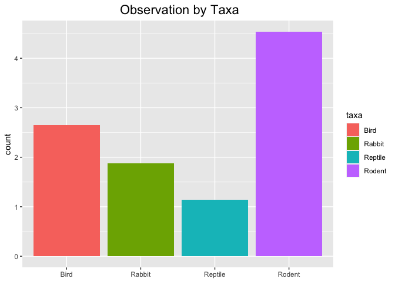
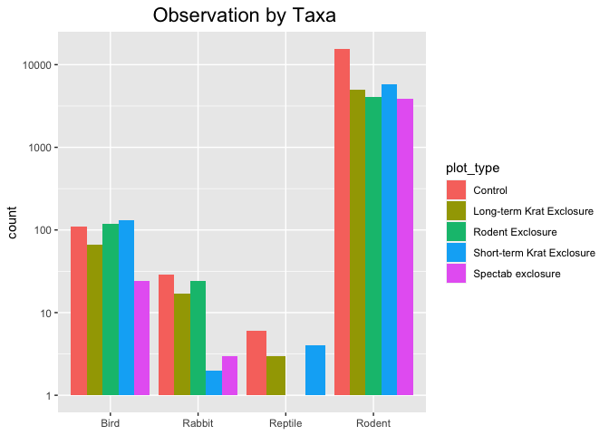
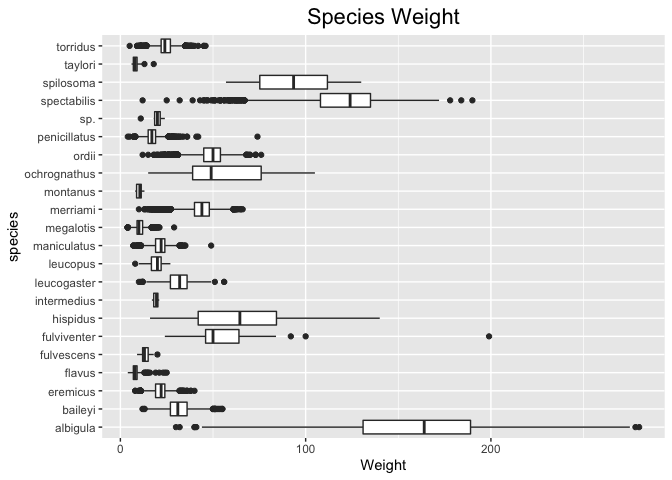
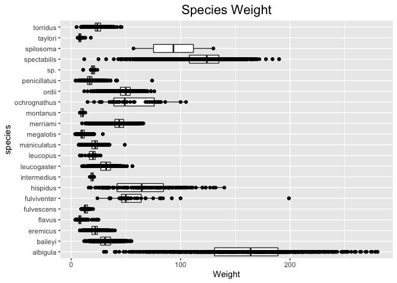
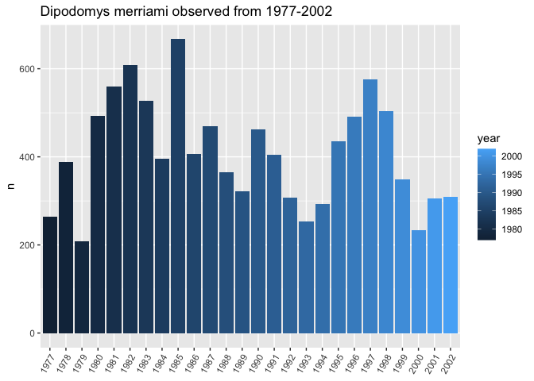
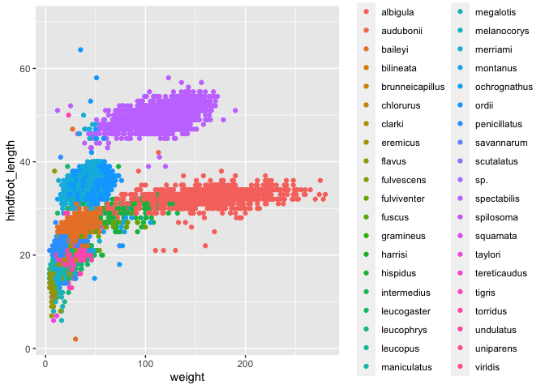
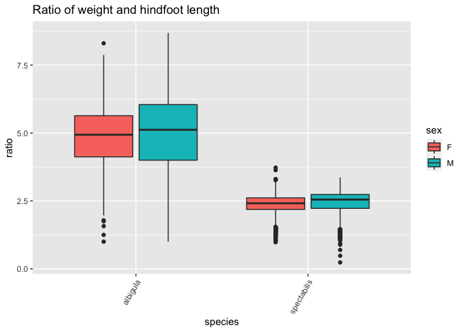
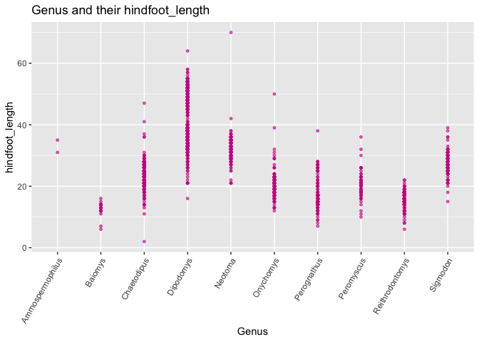

## Instructions
Answer the following questions and complete the exercises in RMarkdown. Please embed all of your code and push your final work to your repository. Your final lab report should be organized, clean, and run free from errors. Remember, you must remove the `#` for the included code chunks to run. Be sure to add your name to the author header above. For any included plots, make sure they are clearly labeled. You are free to use any plot type that you feel best communicates the results of your analysis.  

Make sure to use the formatting conventions of RMarkdown to make your report neat and clean!  

## Load the libraries

```r
library(tidyverse)
library(janitor)
library(here)
library(naniar)
```

## Desert Ecology
For this assignment, we are going to use a modified data set on [desert ecology](http://esapubs.org/archive/ecol/E090/118/). The data are from: S. K. Morgan Ernest, Thomas J. Valone, and James H. Brown. 2009. Long-term monitoring and experimental manipulation of a Chihuahuan Desert ecosystem near Portal, Arizona, USA. Ecology 90:1708.

```r
deserts <- read_csv(here("lab10", "data", "surveys_complete.csv"))
```

```
## Rows: 34786 Columns: 13
## ── Column specification ────────────────────────────────────────────────────────
## Delimiter: ","
## chr (6): species_id, sex, genus, species, taxa, plot_type
## dbl (7): record_id, month, day, year, plot_id, hindfoot_length, weight
## 
## ℹ Use `spec()` to retrieve the full column specification for this data.
## ℹ Specify the column types or set `show_col_types = FALSE` to quiet this message.
```

1. Use the function(s) of your choice to get an idea of its structure, including how NA's are treated. Are the data tidy?  

```r
deserts
```

```
## # A tibble: 34,786 × 13
##    record_id month   day  year plot_id species_id sex   hindfoot_length weight
##        <dbl> <dbl> <dbl> <dbl>   <dbl> <chr>      <chr>           <dbl>  <dbl>
##  1         1     7    16  1977       2 NL         M                  32     NA
##  2         2     7    16  1977       3 NL         M                  33     NA
##  3         3     7    16  1977       2 DM         F                  37     NA
##  4         4     7    16  1977       7 DM         M                  36     NA
##  5         5     7    16  1977       3 DM         M                  35     NA
##  6         6     7    16  1977       1 PF         M                  14     NA
##  7         7     7    16  1977       2 PE         F                  NA     NA
##  8         8     7    16  1977       1 DM         M                  37     NA
##  9         9     7    16  1977       1 DM         F                  34     NA
## 10        10     7    16  1977       6 PF         F                  20     NA
## # … with 34,776 more rows, and 4 more variables: genus <chr>, species <chr>,
## #   taxa <chr>, plot_type <chr>
```

```r
summary(deserts)
```

```
##    record_id         month             day            year         plot_id     
##  Min.   :    1   Min.   : 1.000   Min.   : 1.0   Min.   :1977   Min.   : 1.00  
##  1st Qu.: 8964   1st Qu.: 4.000   1st Qu.: 9.0   1st Qu.:1984   1st Qu.: 5.00  
##  Median :17762   Median : 6.000   Median :16.0   Median :1990   Median :11.00  
##  Mean   :17804   Mean   : 6.474   Mean   :16.1   Mean   :1990   Mean   :11.34  
##  3rd Qu.:26655   3rd Qu.:10.000   3rd Qu.:23.0   3rd Qu.:1997   3rd Qu.:17.00  
##  Max.   :35548   Max.   :12.000   Max.   :31.0   Max.   :2002   Max.   :24.00  
##                                                                                
##   species_id            sex            hindfoot_length     weight      
##  Length:34786       Length:34786       Min.   : 2.00   Min.   :  4.00  
##  Class :character   Class :character   1st Qu.:21.00   1st Qu.: 20.00  
##  Mode  :character   Mode  :character   Median :32.00   Median : 37.00  
##                                        Mean   :29.29   Mean   : 42.67  
##                                        3rd Qu.:36.00   3rd Qu.: 48.00  
##                                        Max.   :70.00   Max.   :280.00  
##                                        NA's   :3348    NA's   :2503    
##     genus             species              taxa            plot_type        
##  Length:34786       Length:34786       Length:34786       Length:34786      
##  Class :character   Class :character   Class :character   Class :character  
##  Mode  :character   Mode  :character   Mode  :character   Mode  :character  
##                                                                             
##                                                                             
##                                                                             
## 
```


```r
naniar::miss_var_summary(deserts)
```

```
## # A tibble: 13 × 3
##    variable        n_miss pct_miss
##    <chr>            <int>    <dbl>
##  1 hindfoot_length   3348     9.62
##  2 weight            2503     7.20
##  3 sex               1748     5.03
##  4 record_id            0     0   
##  5 month                0     0   
##  6 day                  0     0   
##  7 year                 0     0   
##  8 plot_id              0     0   
##  9 species_id           0     0   
## 10 genus                0     0   
## 11 species              0     0   
## 12 taxa                 0     0   
## 13 plot_type            0     0
```
#No, the data is not tidy. This time, the column names are in the correct format, so we dont have too use janitor, but it also contains a lot of NA's. 

2. How many genera and species are represented in the data? What are the total number of observations? Which species is most/ least frequently sampled in the study?

```r
deserts%>%
  summarize(totn_genera=n_distinct(genus),
            totn_species=n_distinct(genus),
            tot_observations=n())
```

```
## # A tibble: 1 × 3
##   totn_genera totn_species tot_observations
##         <int>        <int>            <int>
## 1          26           26            34786
```

```r
deserts%>% 
  count(species, sort=T)
```

```
## # A tibble: 40 × 2
##    species          n
##    <chr>        <int>
##  1 merriami     10596
##  2 penicillatus  3123
##  3 ordii         3027
##  4 baileyi       2891
##  5 megalotis     2609
##  6 spectabilis   2504
##  7 torridus      2249
##  8 flavus        1597
##  9 eremicus      1299
## 10 albigula      1252
## # … with 30 more rows
```

3. What is the proportion of taxa included in this study? Show a table and plot that reflects this count.


```r
deserts%>%
  count(taxa)%>%
ggplot(aes(x=taxa, y=log10(n), fill=taxa))+geom_col()+
  labs(title = " Observation by Taxa",
       x = NULL,
       y = "count")+
theme(plot.title = element_text(size = rel(1.5), hjust = 0.5))
```

<!-- -->

4. For the taxa included in the study, use the fill option to show the proportion of individuals sampled by `plot_type.`

```r
deserts%>%
ggplot(aes(x=taxa, fill=plot_type))+ geom_bar(position = "dodge")+scale_y_log10()+
  labs(title = " Observation by Taxa",
       x = NULL,
       y = "count")+
theme(plot.title = element_text(size = rel(1.5), hjust = 0.5))
```

<!-- -->

5. What is the range of weight for each species included in the study? Remove any observations of weight that are NA so they do not show up in the plot.

```r
deserts %>% 
  filter(weight!="NA") %>% 
  ggplot(aes(x=species, y=weight)) +
  geom_boxplot()+
  coord_flip() +
  labs(title = "Species Weight",
       x = "species",
       y = "Weight")+
  theme(plot.title = element_text(size = rel(1.5), hjust = 0.5))
```

<!-- -->

6. Add another layer to your answer from #4 using `geom_point` to get an idea of how many measurements were taken for each species.

```r
deserts %>% 
  filter(weight!="NA") %>% 
  ggplot(aes(x=species, y=weight)) +
  geom_boxplot()+
  geom_point()+
  coord_flip() +
  labs(title = "Species Weight",
       x = "species",
       y = "Weight")+
  theme(plot.title = element_text(size = rel(1.5), hjust = 0.5))
```

<!-- -->
#ummmm, is it supposed to look like that? 

7. [Dipodomys merriami](https://en.wikipedia.org/wiki/Merriam's_kangaroo_rat) is the most frequently sampled animal in the study. How have the number of observations of this species changed over the years included in the study?

```r
deserts%>%
  filter(species_id=="DM")%>%
  group_by(year)%>%
  summarize(number_observed=n())
```

```
## # A tibble: 26 × 2
##     year number_observed
##    <dbl>           <int>
##  1  1977             264
##  2  1978             389
##  3  1979             209
##  4  1980             493
##  5  1981             559
##  6  1982             609
##  7  1983             528
##  8  1984             396
##  9  1985             667
## 10  1986             406
## # … with 16 more rows
```


```r
 merriami<-deserts%>%
  filter(species_id=="DM")%>%
  group_by(year)%>%
  summarize(number_observed=n())%>%
ggplot(aes(x=as.factor(year), y=number_observed, fill=year))+ geom_col()+theme(axis.text.x = element_text(angle = 60, hjust = 1))+
  labs(title = "Dipodomys merriami observed from 1977-2002",
x = NULL,
y= "n")
merriami
```

<!-- -->

8. What is the relationship between `weight` and `hindfoot` length? Consider whether or not over plotting is an issue.

```r
deserts%>%
  ggplot(aes(x=weight,y=hindfoot_length,color=species))+
  geom_point()
```

```
## Warning: Removed 4048 rows containing missing values (geom_point).
```

<!-- -->

9. Which two species have, on average, the highest weight? Once you have identified them, make a new column that is a ratio of `weight` to `hindfoot_length`. Make a plot that shows the range of this new ratio and fill by sex.

```r
deserts%>%
  filter(!is.na(weight))%>%
  group_by(species)%>%
  summarise(mean_weight=mean(weight))%>%
  arrange(desc(mean_weight))
```

```
## # A tibble: 22 × 2
##    species      mean_weight
##    <chr>              <dbl>
##  1 albigula           159. 
##  2 spectabilis        120. 
##  3 spilosoma           93.5
##  4 hispidus            65.6
##  5 fulviventer         58.9
##  6 ochrognathus        55.4
##  7 ordii               48.9
##  8 merriami            43.2
##  9 baileyi             31.7
## 10 leucogaster         31.6
## # … with 12 more rows
```

```r
ratio_deserts<-deserts%>%
  filter(species %in% c("spectabilis","albigula"),!is.na(weight),!is.na(hindfoot_length),!sex=="NA")%>%
  mutate(ratio=weight/hindfoot_length)%>%
  ggplot(aes(x=species,fill=sex, y=ratio))+geom_boxplot()+theme(axis.text.x = element_text(angle = 60, hjust = 1))+
  labs(title="Ratio of weight and hindfoot length", x="species", y="ratio")
ratio_deserts
```

<!-- -->

10. Make one plot of your choice! Make sure to include at least two of the aesthetics options you have learned.


```r
deserts%>% 
  filter(hindfoot_length!="NA") %>%
 ggplot(aes(x = genus, y = hindfoot_length))+
  geom_point(size=1, color="violetred", alpha=0.6)+
  labs(title = "Genus and their hindfoot_length",
       x = "Genus",
       y = "hindfoot_length")+ 
  theme(axis.text.x = element_text(angle = 60, hjust = 1))
```

<!-- -->

## Push your final code to GitHub!
Please be sure that you check the `keep md` file in the knit preferences. 
