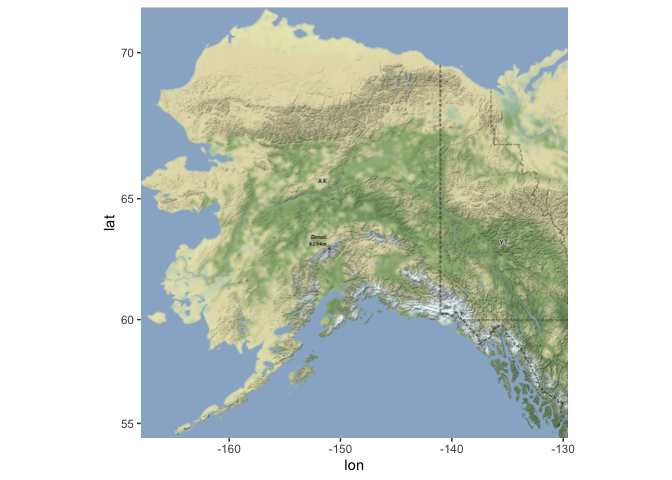
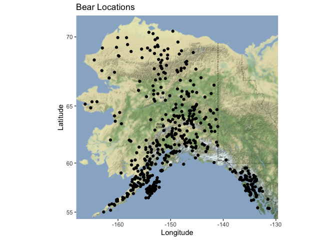
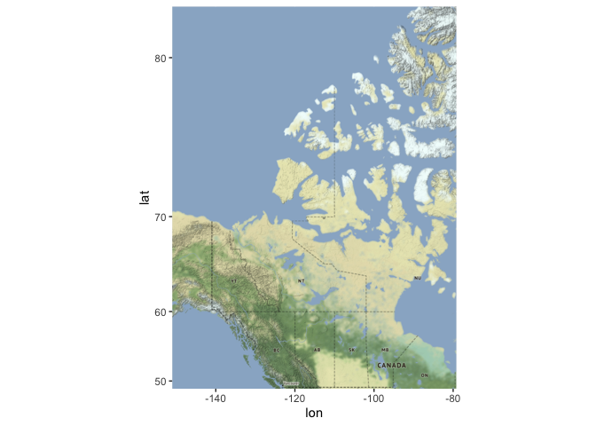
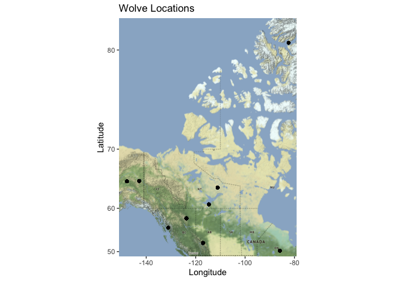
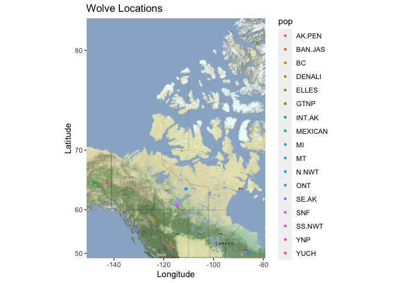

## Instructions
Answer the following questions and complete the exercises in RMarkdown. Please embed all of your code and push your final work to your repository. Your final lab report should be organized, clean, and run free from errors. Remember, you must remove the `#` for the included code chunks to run. Be sure to add your name to the author header above. For any included plots, make sure they are clearly labeled. You are free to use any plot type that you feel best communicates the results of your analysis.  

Make sure to use the formatting conventions of RMarkdown to make your report neat and clean!  

## Load the libraries

```r
library(tidyverse)
library(janitor)
library(here)
library(ggmap)
library(albersusa)
```

## Load the Data
We will use two separate data sets for this homework.  

1. The first [data set](https://rcweb.dartmouth.edu/~f002d69/workshops/index_rspatial.html) represent sightings of grizzly bears (Ursos arctos) in Alaska.  
2. The second data set is from Brandell, Ellen E (2021), Serological dataset and R code for: Patterns and processes of pathogen exposure in gray wolves across North America, Dryad, [Dataset](https://doi.org/10.5061/dryad.5hqbzkh51).  

1. Load the `grizzly` data and evaluate its structure. As part of this step, produce a summary that provides the range of latitude and longitude so you can build an appropriate bounding box.

```r
bear<- read_csv(here("lab12","data","bear-sightings.csv"))
```

```
## Rows: 494 Columns: 3
## ── Column specification ────────────────────────────────────────────────────────
## Delimiter: ","
## dbl (3): bear.id, longitude, latitude
## 
## ℹ Use `spec()` to retrieve the full column specification for this data.
## ℹ Specify the column types or set `show_col_types = FALSE` to quiet this message.
```


```r
bear %>% 
  select(latitude, longitude) %>% 
  summary()
```

```
##     latitude       longitude     
##  Min.   :55.02   Min.   :-166.2  
##  1st Qu.:58.13   1st Qu.:-154.2  
##  Median :60.97   Median :-151.0  
##  Mean   :61.41   Mean   :-149.1  
##  3rd Qu.:64.13   3rd Qu.:-145.6  
##  Max.   :70.37   Max.   :-131.3
```

2. Use the range of the latitude and longitude to build an appropriate bounding box for your map.

```r
lat <- c(55.02, 70.57)
long <- c(-166.2, -131.3)
bbox <- make_bbox(long, lat, f = 0.05)
```

3. Load a map from `stamen` in a terrain style projection and display the map.


```r
bear_map1 <- get_map(bbox, maptype = "terrain", source = "stamen")
```

```
## Source : http://tile.stamen.com/terrain/5/1/6.png
```

```
## Source : http://tile.stamen.com/terrain/5/2/6.png
```

```
## Source : http://tile.stamen.com/terrain/5/3/6.png
```

```
## Source : http://tile.stamen.com/terrain/5/4/6.png
```

```
## Source : http://tile.stamen.com/terrain/5/1/7.png
```

```
## Source : http://tile.stamen.com/terrain/5/2/7.png
```

```
## Source : http://tile.stamen.com/terrain/5/3/7.png
```

```
## Source : http://tile.stamen.com/terrain/5/4/7.png
```

```
## Source : http://tile.stamen.com/terrain/5/1/8.png
```

```
## Source : http://tile.stamen.com/terrain/5/2/8.png
```

```
## Source : http://tile.stamen.com/terrain/5/3/8.png
```

```
## Source : http://tile.stamen.com/terrain/5/4/8.png
```

```
## Source : http://tile.stamen.com/terrain/5/1/9.png
```

```
## Source : http://tile.stamen.com/terrain/5/2/9.png
```

```
## Source : http://tile.stamen.com/terrain/5/3/9.png
```

```
## Source : http://tile.stamen.com/terrain/5/4/9.png
```

```
## Source : http://tile.stamen.com/terrain/5/1/10.png
```

```
## Source : http://tile.stamen.com/terrain/5/2/10.png
```

```
## Source : http://tile.stamen.com/terrain/5/3/10.png
```

```
## Source : http://tile.stamen.com/terrain/5/4/10.png
```


```r
ggmap(bear_map1)
```

<!-- -->

4. Build a final map that overlays the recorded observations of grizzly bears in Alaska.

```r
ggmap(bear_map1) + 
  geom_point(data = bear, aes(longitude, latitude)) +
  labs(x = "Longitude", y = "Latitude", title = "Bear Locations")
```

<!-- -->

5. Let's switch to the wolves data. Load the data and evaluate its structure.

```r
wolves <-read_csv(here("lab12","data","wolves_data", "wolves_dataset.csv"))
```

```
## Rows: 1986 Columns: 23
## ── Column specification ────────────────────────────────────────────────────────
## Delimiter: ","
## chr  (4): pop, age.cat, sex, color
## dbl (19): year, lat, long, habitat, human, pop.density, pack.size, standard....
## 
## ℹ Use `spec()` to retrieve the full column specification for this data.
## ℹ Specify the column types or set `show_col_types = FALSE` to quiet this message.
```

```r
wolves
```

```
## # A tibble: 1,986 × 23
##    pop     year age.cat sex   color   lat  long habitat human pop.density
##    <chr>  <dbl> <chr>   <chr> <chr> <dbl> <dbl>   <dbl> <dbl>       <dbl>
##  1 AK.PEN  2006 S       F     G      57.0 -158.    254.  10.4           8
##  2 AK.PEN  2006 S       M     G      57.0 -158.    254.  10.4           8
##  3 AK.PEN  2006 A       F     G      57.0 -158.    254.  10.4           8
##  4 AK.PEN  2006 S       M     B      57.0 -158.    254.  10.4           8
##  5 AK.PEN  2006 A       M     B      57.0 -158.    254.  10.4           8
##  6 AK.PEN  2006 A       M     G      57.0 -158.    254.  10.4           8
##  7 AK.PEN  2006 A       F     G      57.0 -158.    254.  10.4           8
##  8 AK.PEN  2006 P       M     G      57.0 -158.    254.  10.4           8
##  9 AK.PEN  2006 S       F     G      57.0 -158.    254.  10.4           8
## 10 AK.PEN  2006 P       M     G      57.0 -158.    254.  10.4           8
## # … with 1,976 more rows, and 13 more variables: pack.size <dbl>,
## #   standard.habitat <dbl>, standard.human <dbl>, standard.pop <dbl>,
## #   standard.packsize <dbl>, standard.latitude <dbl>, standard.longitude <dbl>,
## #   cav.binary <dbl>, cdv.binary <dbl>, cpv.binary <dbl>, chv.binary <dbl>,
## #   neo.binary <dbl>, toxo.binary <dbl>
```


```r
glimpse(wolves)
```

```
## Rows: 1,986
## Columns: 23
## $ pop                <chr> "AK.PEN", "AK.PEN", "AK.PEN", "AK.PEN", "AK.PEN", "…
## $ year               <dbl> 2006, 2006, 2006, 2006, 2006, 2006, 2006, 2006, 200…
## $ age.cat            <chr> "S", "S", "A", "S", "A", "A", "A", "P", "S", "P", "…
## $ sex                <chr> "F", "M", "F", "M", "M", "M", "F", "M", "F", "M", "…
## $ color              <chr> "G", "G", "G", "B", "B", "G", "G", "G", "G", "G", "…
## $ lat                <dbl> 57.03983, 57.03983, 57.03983, 57.03983, 57.03983, 5…
## $ long               <dbl> -157.8427, -157.8427, -157.8427, -157.8427, -157.84…
## $ habitat            <dbl> 254.08, 254.08, 254.08, 254.08, 254.08, 254.08, 254…
## $ human              <dbl> 10.42, 10.42, 10.42, 10.42, 10.42, 10.42, 10.42, 10…
## $ pop.density        <dbl> 8, 8, 8, 8, 8, 8, 8, 8, 8, 8, 8, 8, 8, 8, 8, 8, 8, …
## $ pack.size          <dbl> 8.78, 8.78, 8.78, 8.78, 8.78, 8.78, 8.78, 8.78, 8.7…
## $ standard.habitat   <dbl> -1.6339, -1.6339, -1.6339, -1.6339, -1.6339, -1.633…
## $ standard.human     <dbl> -0.9784, -0.9784, -0.9784, -0.9784, -0.9784, -0.978…
## $ standard.pop       <dbl> -0.6827, -0.6827, -0.6827, -0.6827, -0.6827, -0.682…
## $ standard.packsize  <dbl> 1.3157, 1.3157, 1.3157, 1.3157, 1.3157, 1.3157, 1.3…
## $ standard.latitude  <dbl> 0.7214, 0.7214, 0.7214, 0.7214, 0.7214, 0.7214, 0.7…
## $ standard.longitude <dbl> -2.1441, -2.1441, -2.1441, -2.1441, -2.1441, -2.144…
## $ cav.binary         <dbl> 1, 1, 1, 0, 1, 1, 1, 1, 1, 1, 1, 1, 1, 1, 1, 1, 1, …
## $ cdv.binary         <dbl> 0, 0, 0, 0, 0, 1, 0, 0, 0, 0, 0, 0, 0, 0, 0, 0, 0, …
## $ cpv.binary         <dbl> 0, 0, 1, 1, 0, 1, 0, 0, 0, 0, 1, 0, 0, 1, 0, 0, 0, …
## $ chv.binary         <dbl> 1, 1, 1, 1, 1, 1, 1, 1, 1, 0, 1, 1, 1, 1, 1, 1, 1, …
## $ neo.binary         <dbl> NA, NA, NA, 0, 0, NA, NA, 1, 0, 1, NA, 0, NA, NA, N…
## $ toxo.binary        <dbl> NA, NA, NA, 1, 0, NA, NA, 1, 0, 0, NA, 0, NA, NA, N…
```


```r
naniar::miss_var_summary(wolves)
```

```
## # A tibble: 23 × 3
##    variable    n_miss pct_miss
##    <chr>        <int>    <dbl>
##  1 toxo.binary    827   41.6  
##  2 color          616   31.0  
##  3 chv.binary     548   27.6  
##  4 neo.binary     538   27.1  
##  5 cav.binary     321   16.2  
##  6 age.cat        102    5.14 
##  7 cdv.binary      21    1.06 
##  8 sex             19    0.957
##  9 cpv.binary       7    0.352
## 10 pop              0    0    
## # … with 13 more rows
```


```r
wolves_data<-wolves%>%
na_if(NA)
wolves_data
```

```
## # A tibble: 1,986 × 23
##    pop     year age.cat sex   color   lat  long habitat human pop.density
##    <chr>  <dbl> <chr>   <chr> <chr> <dbl> <dbl>   <dbl> <dbl>       <dbl>
##  1 AK.PEN  2006 S       F     G      57.0 -158.    254.  10.4           8
##  2 AK.PEN  2006 S       M     G      57.0 -158.    254.  10.4           8
##  3 AK.PEN  2006 A       F     G      57.0 -158.    254.  10.4           8
##  4 AK.PEN  2006 S       M     B      57.0 -158.    254.  10.4           8
##  5 AK.PEN  2006 A       M     B      57.0 -158.    254.  10.4           8
##  6 AK.PEN  2006 A       M     G      57.0 -158.    254.  10.4           8
##  7 AK.PEN  2006 A       F     G      57.0 -158.    254.  10.4           8
##  8 AK.PEN  2006 P       M     G      57.0 -158.    254.  10.4           8
##  9 AK.PEN  2006 S       F     G      57.0 -158.    254.  10.4           8
## 10 AK.PEN  2006 P       M     G      57.0 -158.    254.  10.4           8
## # … with 1,976 more rows, and 13 more variables: pack.size <dbl>,
## #   standard.habitat <dbl>, standard.human <dbl>, standard.pop <dbl>,
## #   standard.packsize <dbl>, standard.latitude <dbl>, standard.longitude <dbl>,
## #   cav.binary <dbl>, cdv.binary <dbl>, cpv.binary <dbl>, chv.binary <dbl>,
## #   neo.binary <dbl>, toxo.binary <dbl>
```

6. How many distinct wolf populations are included in this study? Mae a new object that restricts the data to the wolf populations in the lower 48 US states.

```r
wolves%>%
  count(pop)%>%
  arrange(desc(n))
```

```
## # A tibble: 17 × 2
##    pop         n
##    <chr>   <int>
##  1 YNP       383
##  2 MT        351
##  3 MEXICAN   181
##  4 DENALI    154
##  5 BC        145
##  6 YUCH      105
##  7 MI        102
##  8 AK.PEN    100
##  9 BAN.JAS    96
## 10 SNF        92
## 11 N.NWT      67
## 12 GTNP       60
## 13 ONT        60
## 14 INT.AK     35
## 15 SS.NWT     34
## 16 ELLES      11
## 17 SE.AK      10
```


```r
wolves_pop_us<-wolves%>%
  filter(pop%in%c("SE.AK", "ELLES", "SS.NWT", "INT.AK", "ONT"))
wolves_pop_us
```

```
## # A tibble: 150 × 23
##    pop    year age.cat sex   color   lat  long habitat human pop.density
##    <chr> <dbl> <chr>   <chr> <chr> <dbl> <dbl>   <dbl> <dbl>       <dbl>
##  1 ELLES  2014 S       M     G      80.5 -82.4    261.  0.02         7.1
##  2 ELLES  2014 S       F     G      80.5 -82.4    261.  0.02         7.1
##  3 ELLES  2014 A       F     G      80.5 -82.4    261.  0.02         7.1
##  4 ELLES  2014 A       M     G      80.5 -82.4    261.  0.02         7.1
##  5 ELLES  2015 A       M     G      80.5 -82.4    261.  0.02         7.1
##  6 ELLES  2015 A       F     G      80.5 -82.4    261.  0.02         7.1
##  7 ELLES  2016 A       F     G      80.5 -82.4    261.  0.02         7.1
##  8 ELLES  2016 S       F     G      80.5 -82.4    261.  0.02         7.1
##  9 ELLES  2017 A       F     G      80.5 -82.4    261.  0.02         7.1
## 10 ELLES  2017 A       M     G      80.5 -82.4    261.  0.02         7.1
## # … with 140 more rows, and 13 more variables: pack.size <dbl>,
## #   standard.habitat <dbl>, standard.human <dbl>, standard.pop <dbl>,
## #   standard.packsize <dbl>, standard.latitude <dbl>, standard.longitude <dbl>,
## #   cav.binary <dbl>, cdv.binary <dbl>, cpv.binary <dbl>, chv.binary <dbl>,
## #   neo.binary <dbl>, toxo.binary <dbl>
```

7. Use the range of the latitude and longitude to build an appropriate bounding box for your map.


```r
wolves_pop_us%>%
  select(lat, long)%>%
  summary()
```

```
##       lat             long        
##  Min.   :50.24   Min.   :-147.75  
##  1st Qu.:50.24   1st Qu.:-131.10  
##  Median :60.79   Median :-114.67  
##  Mean   :58.67   Mean   :-109.63  
##  3rd Qu.:65.02   3rd Qu.: -85.95  
##  Max.   :80.50   Max.   : -82.42
```


```r
lat <- c(50.24, 80.50)
long <- c(-147.75, -82.42)
bbox <- make_bbox(long, lat, f = 0.05)
```

8. Load a map from `stamen` in a `terrain-lines` projection and display the map.

```r
wolves_map1<- get_map(bbox, maptype = "terrain", source = "stamen")
```

```
## Source : http://tile.stamen.com/terrain/4/1/1.png
```

```
## Source : http://tile.stamen.com/terrain/4/2/1.png
```

```
## Source : http://tile.stamen.com/terrain/4/3/1.png
```

```
## Source : http://tile.stamen.com/terrain/4/4/1.png
```

```
## Source : http://tile.stamen.com/terrain/4/1/2.png
```

```
## Source : http://tile.stamen.com/terrain/4/2/2.png
```

```
## Source : http://tile.stamen.com/terrain/4/3/2.png
```

```
## Source : http://tile.stamen.com/terrain/4/4/2.png
```

```
## Source : http://tile.stamen.com/terrain/4/1/3.png
```

```
## Source : http://tile.stamen.com/terrain/4/2/3.png
```

```
## Source : http://tile.stamen.com/terrain/4/3/3.png
```

```
## Source : http://tile.stamen.com/terrain/4/4/3.png
```

```
## Source : http://tile.stamen.com/terrain/4/1/4.png
```

```
## Source : http://tile.stamen.com/terrain/4/2/4.png
```

```
## Source : http://tile.stamen.com/terrain/4/3/4.png
```

```
## Source : http://tile.stamen.com/terrain/4/4/4.png
```

```
## Source : http://tile.stamen.com/terrain/4/1/5.png
```

```
## Source : http://tile.stamen.com/terrain/4/2/5.png
```

```
## Source : http://tile.stamen.com/terrain/4/3/5.png
```

```
## Source : http://tile.stamen.com/terrain/4/4/5.png
```


```r
ggmap(wolves_map1)
```

<!-- -->

9. What is the average pack size for the wolves in this study by region?

```r
ggmap(wolves_map1)+
  geom_point(data=wolves, aes(long, lat))+
  labs(x="Longitude", y= "Latitude", title = "Wolve Locations")
```

```
## Warning: Removed 1423 rows containing missing values (geom_point).
```

<!-- -->

10. Use the map from #9 above, but add some aesthetics. Try to `fill` and `color` by population.

```r
ggmap(wolves_map1)+
  geom_point(data=wolves, mapping=aes(x=long, y=lat, color=pop, fill=pop),size=1)+
  labs(x="Longitude", y= "Latitude", title = "Wolve Locations")
```

```
## Warning: Removed 1423 rows containing missing values (geom_point).
```

<!-- -->

## Push your final code to GitHub!
Please be sure that you check the `keep md` file in the knit preferences. 
