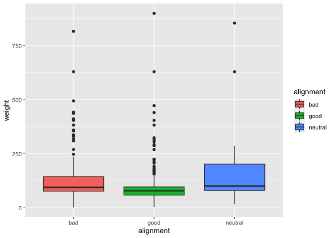
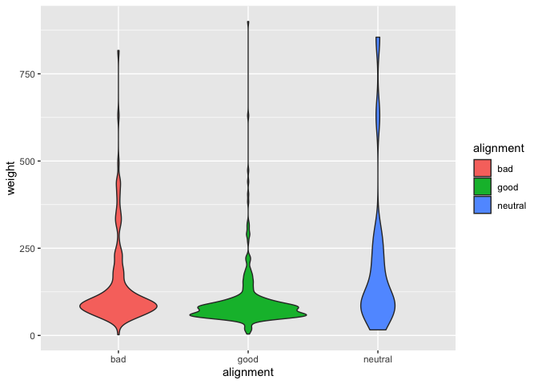
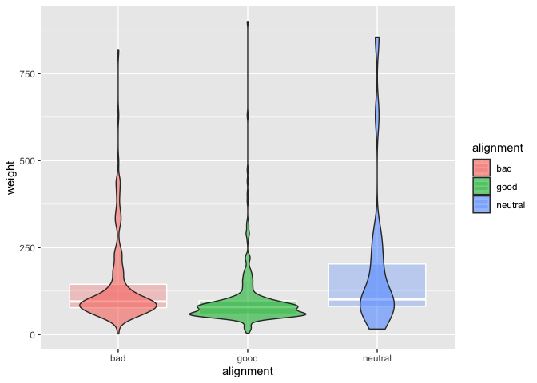
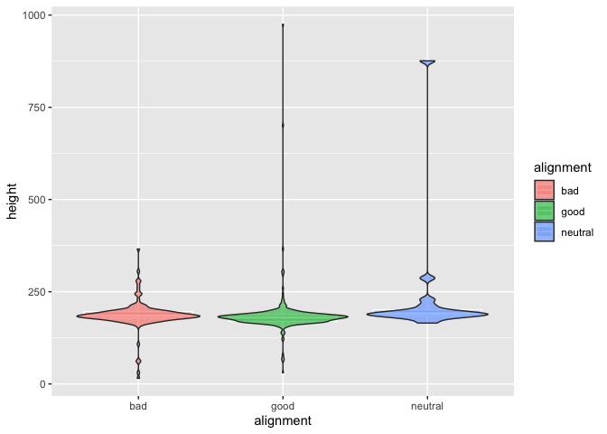
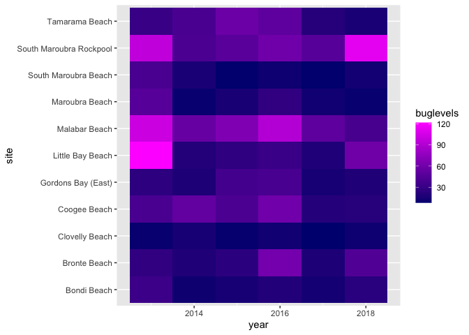
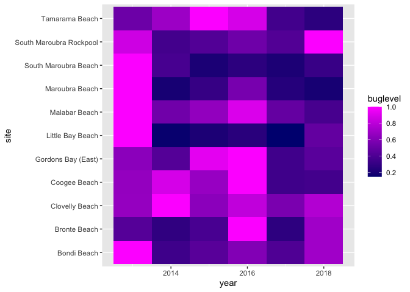
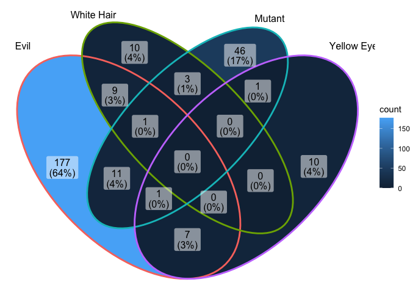
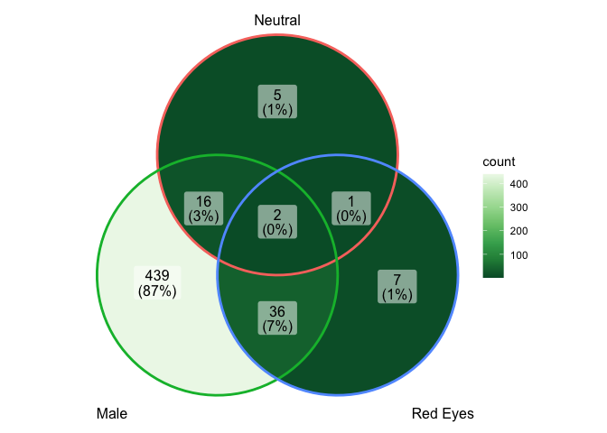
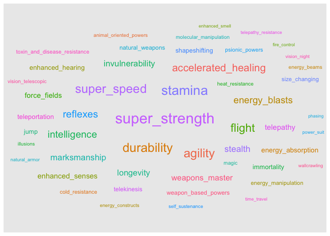
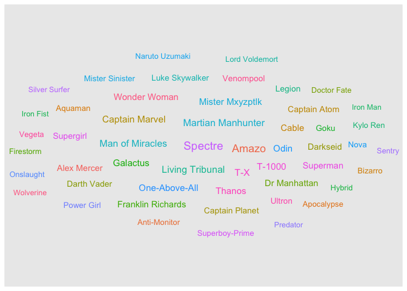

### Libraries

### Load the Libraries

```r
library(tidyverse)
```

```
## ── Attaching packages ─────────────────────────────────────── tidyverse 1.3.1 ──
```

```
## ✓ ggplot2 3.3.5     ✓ purrr   0.3.4
## ✓ tibble  3.1.6     ✓ dplyr   1.0.8
## ✓ tidyr   1.2.0     ✓ stringr 1.4.0
## ✓ readr   2.1.2     ✓ forcats 0.5.1
```

```
## ── Conflicts ────────────────────────────────────────── tidyverse_conflicts() ──
## x dplyr::filter() masks stats::filter()
## x dplyr::lag()    masks stats::lag()
```

```r
library(janitor)
```

```
## 
## Attaching package: 'janitor'
```

```
## The following objects are masked from 'package:stats':
## 
##     chisq.test, fisher.test
```

```r
library("palmerpenguins")
#install.packages("ggVennDiagram")
library(ggVennDiagram)
library(RColorBrewer)
#install.packages("ggworldcloud")
library(ggwordcloud)
options(scipen=999) #cancels the use of scientific notation for the session
```


### Data

```r
superhero_info <- readr::read_csv("data/heroes_information.csv", na = c("", "-99", "-"))
```

```
## Rows: 734 Columns: 10
## ── Column specification ────────────────────────────────────────────────────────
## Delimiter: ","
## chr (8): name, Gender, Eye color, Race, Hair color, Publisher, Skin color, A...
## dbl (2): Height, Weight
## 
## ℹ Use `spec()` to retrieve the full column specification for this data.
## ℹ Specify the column types or set `show_col_types = FALSE` to quiet this message.
```

```r
superhero_powers <- readr::read_csv("data/super_hero_powers.csv", na = c("", "-99", "-"))
```

```
## Rows: 667 Columns: 168
## ── Column specification ────────────────────────────────────────────────────────
## Delimiter: ","
## chr   (1): hero_names
## lgl (167): Agility, Accelerated Healing, Lantern Power Ring, Dimensional Awa...
## 
## ℹ Use `spec()` to retrieve the full column specification for this data.
## ℹ Specify the column types or set `show_col_types = FALSE` to quiet this message.
```

```r
beachbugs_long <- readr::read_csv("data/beachbugs_long.csv")
```

```
## Rows: 66 Columns: 3
## ── Column specification ────────────────────────────────────────────────────────
## Delimiter: ","
## chr (1): site
## dbl (2): year, buglevels
## 
## ℹ Use `spec()` to retrieve the full column specification for this data.
## ℹ Specify the column types or set `show_col_types = FALSE` to quiet this message.
```


1. Clean up the column names (no capitals, not spaces) of `superhero_info`, then use 2 functions to remind yourself of structure of the `superhero_info` data set.


```r
superhero_info <- readr::read_csv("data/heroes_information.csv", na = c("", "-99", "-"))%>%clean_names()
```

```
## Rows: 734 Columns: 10
## ── Column specification ────────────────────────────────────────────────────────
## Delimiter: ","
## chr (8): name, Gender, Eye color, Race, Hair color, Publisher, Skin color, A...
## dbl (2): Height, Weight
## 
## ℹ Use `spec()` to retrieve the full column specification for this data.
## ℹ Specify the column types or set `show_col_types = FALSE` to quiet this message.
```

```r
superhero_powers <- readr::read_csv("data/super_hero_powers.csv", na = c("", "-99", "-"))%>%clean_names()
```

```
## Rows: 667 Columns: 168
## ── Column specification ────────────────────────────────────────────────────────
## Delimiter: ","
## chr   (1): hero_names
## lgl (167): Agility, Accelerated Healing, Lantern Power Ring, Dimensional Awa...
## 
## ℹ Use `spec()` to retrieve the full column specification for this data.
## ℹ Specify the column types or set `show_col_types = FALSE` to quiet this message.
```


```r
beachbugs_long <- readr::read_csv("data/beachbugs_long.csv")%>%clean_names()
```

```
## Rows: 66 Columns: 3
## ── Column specification ────────────────────────────────────────────────────────
## Delimiter: ","
## chr (1): site
## dbl (2): year, buglevels
## 
## ℹ Use `spec()` to retrieve the full column specification for this data.
## ℹ Specify the column types or set `show_col_types = FALSE` to quiet this message.
```

```r
glimpse(superhero_powers)
```

```
## Rows: 667
## Columns: 168
## $ hero_names                   <chr> "3-D Man", "A-Bomb", "Abe Sapien", "Abin …
## $ agility                      <lgl> TRUE, FALSE, TRUE, FALSE, FALSE, FALSE, F…
## $ accelerated_healing          <lgl> FALSE, TRUE, TRUE, FALSE, TRUE, FALSE, FA…
## $ lantern_power_ring           <lgl> FALSE, FALSE, FALSE, TRUE, FALSE, FALSE, …
## $ dimensional_awareness        <lgl> FALSE, FALSE, FALSE, FALSE, FALSE, TRUE, …
## $ cold_resistance              <lgl> FALSE, FALSE, TRUE, FALSE, FALSE, FALSE, …
## $ durability                   <lgl> FALSE, TRUE, TRUE, FALSE, FALSE, FALSE, T…
## $ stealth                      <lgl> FALSE, FALSE, FALSE, FALSE, FALSE, FALSE,…
## $ energy_absorption            <lgl> FALSE, FALSE, FALSE, FALSE, FALSE, FALSE,…
## $ flight                       <lgl> FALSE, FALSE, FALSE, FALSE, FALSE, TRUE, …
## $ danger_sense                 <lgl> FALSE, FALSE, FALSE, FALSE, FALSE, FALSE,…
## $ underwater_breathing         <lgl> FALSE, FALSE, TRUE, FALSE, FALSE, FALSE, …
## $ marksmanship                 <lgl> FALSE, FALSE, TRUE, FALSE, FALSE, FALSE, …
## $ weapons_master               <lgl> FALSE, FALSE, TRUE, FALSE, FALSE, FALSE, …
## $ power_augmentation           <lgl> FALSE, FALSE, FALSE, FALSE, FALSE, FALSE,…
## $ animal_attributes            <lgl> FALSE, FALSE, FALSE, FALSE, FALSE, FALSE,…
## $ longevity                    <lgl> FALSE, TRUE, TRUE, FALSE, FALSE, FALSE, F…
## $ intelligence                 <lgl> FALSE, FALSE, TRUE, FALSE, TRUE, TRUE, FA…
## $ super_strength               <lgl> TRUE, TRUE, TRUE, FALSE, TRUE, TRUE, TRUE…
## $ cryokinesis                  <lgl> FALSE, FALSE, FALSE, FALSE, FALSE, FALSE,…
## $ telepathy                    <lgl> FALSE, FALSE, TRUE, FALSE, FALSE, FALSE, …
## $ energy_armor                 <lgl> FALSE, FALSE, FALSE, FALSE, FALSE, FALSE,…
## $ energy_blasts                <lgl> FALSE, FALSE, FALSE, FALSE, FALSE, FALSE,…
## $ duplication                  <lgl> FALSE, FALSE, FALSE, FALSE, FALSE, FALSE,…
## $ size_changing                <lgl> FALSE, FALSE, FALSE, FALSE, FALSE, TRUE, …
## $ density_control              <lgl> FALSE, FALSE, FALSE, FALSE, FALSE, FALSE,…
## $ stamina                      <lgl> TRUE, TRUE, TRUE, FALSE, TRUE, FALSE, FAL…
## $ astral_travel                <lgl> FALSE, FALSE, FALSE, FALSE, FALSE, FALSE,…
## $ audio_control                <lgl> FALSE, FALSE, FALSE, FALSE, FALSE, FALSE,…
## $ dexterity                    <lgl> FALSE, FALSE, FALSE, FALSE, FALSE, FALSE,…
## $ omnitrix                     <lgl> FALSE, FALSE, FALSE, FALSE, FALSE, FALSE,…
## $ super_speed                  <lgl> TRUE, FALSE, FALSE, FALSE, TRUE, TRUE, FA…
## $ possession                   <lgl> FALSE, FALSE, FALSE, FALSE, FALSE, FALSE,…
## $ animal_oriented_powers       <lgl> FALSE, FALSE, FALSE, FALSE, FALSE, FALSE,…
## $ weapon_based_powers          <lgl> FALSE, FALSE, FALSE, FALSE, FALSE, FALSE,…
## $ electrokinesis               <lgl> FALSE, FALSE, FALSE, FALSE, FALSE, FALSE,…
## $ darkforce_manipulation       <lgl> FALSE, FALSE, FALSE, FALSE, FALSE, FALSE,…
## $ death_touch                  <lgl> FALSE, FALSE, FALSE, FALSE, FALSE, FALSE,…
## $ teleportation                <lgl> FALSE, FALSE, FALSE, FALSE, FALSE, TRUE, …
## $ enhanced_senses              <lgl> FALSE, FALSE, FALSE, FALSE, FALSE, FALSE,…
## $ telekinesis                  <lgl> FALSE, FALSE, FALSE, FALSE, FALSE, FALSE,…
## $ energy_beams                 <lgl> FALSE, FALSE, FALSE, FALSE, FALSE, FALSE,…
## $ magic                        <lgl> FALSE, FALSE, FALSE, FALSE, FALSE, TRUE, …
## $ hyperkinesis                 <lgl> FALSE, FALSE, FALSE, FALSE, FALSE, FALSE,…
## $ jump                         <lgl> FALSE, FALSE, FALSE, FALSE, FALSE, FALSE,…
## $ clairvoyance                 <lgl> FALSE, FALSE, FALSE, FALSE, FALSE, FALSE,…
## $ dimensional_travel           <lgl> FALSE, FALSE, FALSE, FALSE, FALSE, TRUE, …
## $ power_sense                  <lgl> FALSE, FALSE, FALSE, FALSE, FALSE, FALSE,…
## $ shapeshifting                <lgl> FALSE, FALSE, FALSE, FALSE, FALSE, FALSE,…
## $ peak_human_condition         <lgl> FALSE, FALSE, FALSE, FALSE, FALSE, FALSE,…
## $ immortality                  <lgl> FALSE, FALSE, TRUE, FALSE, FALSE, TRUE, F…
## $ camouflage                   <lgl> FALSE, TRUE, FALSE, FALSE, FALSE, FALSE, …
## $ element_control              <lgl> FALSE, FALSE, FALSE, FALSE, FALSE, FALSE,…
## $ phasing                      <lgl> FALSE, FALSE, FALSE, FALSE, FALSE, FALSE,…
## $ astral_projection            <lgl> FALSE, FALSE, FALSE, FALSE, FALSE, FALSE,…
## $ electrical_transport         <lgl> FALSE, FALSE, FALSE, FALSE, FALSE, FALSE,…
## $ fire_control                 <lgl> FALSE, FALSE, FALSE, FALSE, FALSE, FALSE,…
## $ projection                   <lgl> FALSE, FALSE, FALSE, FALSE, FALSE, FALSE,…
## $ summoning                    <lgl> FALSE, FALSE, FALSE, FALSE, FALSE, FALSE,…
## $ enhanced_memory              <lgl> FALSE, FALSE, FALSE, FALSE, FALSE, FALSE,…
## $ reflexes                     <lgl> FALSE, FALSE, TRUE, FALSE, FALSE, FALSE, …
## $ invulnerability              <lgl> FALSE, FALSE, FALSE, FALSE, TRUE, TRUE, T…
## $ energy_constructs            <lgl> FALSE, FALSE, FALSE, FALSE, FALSE, FALSE,…
## $ force_fields                 <lgl> FALSE, FALSE, FALSE, FALSE, FALSE, FALSE,…
## $ self_sustenance              <lgl> FALSE, TRUE, FALSE, FALSE, FALSE, FALSE, …
## $ anti_gravity                 <lgl> FALSE, FALSE, FALSE, FALSE, FALSE, FALSE,…
## $ empathy                      <lgl> FALSE, FALSE, FALSE, FALSE, FALSE, FALSE,…
## $ power_nullifier              <lgl> FALSE, FALSE, FALSE, FALSE, FALSE, FALSE,…
## $ radiation_control            <lgl> FALSE, FALSE, FALSE, FALSE, FALSE, FALSE,…
## $ psionic_powers               <lgl> FALSE, FALSE, FALSE, FALSE, FALSE, FALSE,…
## $ elasticity                   <lgl> FALSE, FALSE, FALSE, FALSE, FALSE, FALSE,…
## $ substance_secretion          <lgl> FALSE, FALSE, FALSE, FALSE, FALSE, FALSE,…
## $ elemental_transmogrification <lgl> FALSE, FALSE, FALSE, FALSE, FALSE, FALSE,…
## $ technopath_cyberpath         <lgl> FALSE, FALSE, FALSE, FALSE, FALSE, FALSE,…
## $ photographic_reflexes        <lgl> FALSE, FALSE, FALSE, FALSE, FALSE, FALSE,…
## $ seismic_power                <lgl> FALSE, FALSE, FALSE, FALSE, FALSE, FALSE,…
## $ animation                    <lgl> FALSE, FALSE, FALSE, FALSE, TRUE, FALSE, …
## $ precognition                 <lgl> FALSE, FALSE, FALSE, FALSE, FALSE, FALSE,…
## $ mind_control                 <lgl> FALSE, FALSE, FALSE, FALSE, FALSE, FALSE,…
## $ fire_resistance              <lgl> FALSE, FALSE, FALSE, FALSE, FALSE, FALSE,…
## $ power_absorption             <lgl> FALSE, FALSE, FALSE, FALSE, FALSE, FALSE,…
## $ enhanced_hearing             <lgl> FALSE, FALSE, FALSE, FALSE, FALSE, FALSE,…
## $ nova_force                   <lgl> FALSE, FALSE, FALSE, FALSE, FALSE, FALSE,…
## $ insanity                     <lgl> FALSE, FALSE, FALSE, FALSE, FALSE, FALSE,…
## $ hypnokinesis                 <lgl> FALSE, FALSE, FALSE, FALSE, FALSE, FALSE,…
## $ animal_control               <lgl> FALSE, FALSE, FALSE, FALSE, FALSE, FALSE,…
## $ natural_armor                <lgl> FALSE, FALSE, FALSE, FALSE, FALSE, FALSE,…
## $ intangibility                <lgl> FALSE, FALSE, FALSE, FALSE, FALSE, FALSE,…
## $ enhanced_sight               <lgl> FALSE, FALSE, TRUE, FALSE, FALSE, FALSE, …
## $ molecular_manipulation       <lgl> FALSE, FALSE, FALSE, FALSE, FALSE, TRUE, …
## $ heat_generation              <lgl> FALSE, FALSE, FALSE, FALSE, FALSE, FALSE,…
## $ adaptation                   <lgl> FALSE, FALSE, FALSE, FALSE, FALSE, FALSE,…
## $ gliding                      <lgl> FALSE, FALSE, FALSE, FALSE, FALSE, FALSE,…
## $ power_suit                   <lgl> FALSE, FALSE, FALSE, FALSE, FALSE, FALSE,…
## $ mind_blast                   <lgl> FALSE, FALSE, FALSE, FALSE, FALSE, FALSE,…
## $ probability_manipulation     <lgl> FALSE, FALSE, FALSE, FALSE, FALSE, FALSE,…
## $ gravity_control              <lgl> FALSE, FALSE, FALSE, FALSE, FALSE, FALSE,…
## $ regeneration                 <lgl> FALSE, FALSE, FALSE, FALSE, FALSE, FALSE,…
## $ light_control                <lgl> FALSE, FALSE, FALSE, FALSE, FALSE, FALSE,…
## $ echolocation                 <lgl> FALSE, FALSE, FALSE, FALSE, FALSE, FALSE,…
## $ levitation                   <lgl> FALSE, FALSE, FALSE, FALSE, FALSE, FALSE,…
## $ toxin_and_disease_control    <lgl> FALSE, FALSE, FALSE, FALSE, FALSE, FALSE,…
## $ banish                       <lgl> FALSE, FALSE, FALSE, FALSE, FALSE, FALSE,…
## $ energy_manipulation          <lgl> FALSE, FALSE, FALSE, FALSE, FALSE, TRUE, …
## $ heat_resistance              <lgl> FALSE, FALSE, FALSE, FALSE, FALSE, FALSE,…
## $ natural_weapons              <lgl> FALSE, FALSE, FALSE, FALSE, FALSE, FALSE,…
## $ time_travel                  <lgl> FALSE, FALSE, FALSE, FALSE, FALSE, FALSE,…
## $ enhanced_smell               <lgl> FALSE, FALSE, FALSE, FALSE, FALSE, FALSE,…
## $ illusions                    <lgl> FALSE, FALSE, FALSE, FALSE, FALSE, FALSE,…
## $ thirstokinesis               <lgl> FALSE, FALSE, FALSE, FALSE, FALSE, FALSE,…
## $ hair_manipulation            <lgl> FALSE, FALSE, FALSE, FALSE, FALSE, FALSE,…
## $ illumination                 <lgl> FALSE, FALSE, FALSE, FALSE, FALSE, FALSE,…
## $ omnipotent                   <lgl> FALSE, FALSE, FALSE, FALSE, FALSE, FALSE,…
## $ cloaking                     <lgl> FALSE, FALSE, FALSE, FALSE, FALSE, FALSE,…
## $ changing_armor               <lgl> FALSE, FALSE, FALSE, FALSE, FALSE, FALSE,…
## $ power_cosmic                 <lgl> FALSE, FALSE, FALSE, FALSE, FALSE, TRUE, …
## $ biokinesis                   <lgl> FALSE, FALSE, FALSE, FALSE, FALSE, FALSE,…
## $ water_control                <lgl> FALSE, FALSE, FALSE, FALSE, FALSE, FALSE,…
## $ radiation_immunity           <lgl> FALSE, FALSE, FALSE, FALSE, FALSE, FALSE,…
## $ vision_telescopic            <lgl> FALSE, FALSE, FALSE, FALSE, FALSE, FALSE,…
## $ toxin_and_disease_resistance <lgl> FALSE, FALSE, FALSE, FALSE, FALSE, FALSE,…
## $ spatial_awareness            <lgl> FALSE, FALSE, FALSE, FALSE, FALSE, FALSE,…
## $ energy_resistance            <lgl> FALSE, FALSE, FALSE, FALSE, FALSE, FALSE,…
## $ telepathy_resistance         <lgl> FALSE, FALSE, FALSE, FALSE, FALSE, FALSE,…
## $ molecular_combustion         <lgl> FALSE, FALSE, FALSE, FALSE, FALSE, FALSE,…
## $ omnilingualism               <lgl> FALSE, FALSE, FALSE, FALSE, FALSE, FALSE,…
## $ portal_creation              <lgl> FALSE, FALSE, FALSE, FALSE, FALSE, FALSE,…
## $ magnetism                    <lgl> FALSE, FALSE, FALSE, FALSE, FALSE, FALSE,…
## $ mind_control_resistance      <lgl> FALSE, FALSE, FALSE, FALSE, FALSE, FALSE,…
## $ plant_control                <lgl> FALSE, FALSE, FALSE, FALSE, FALSE, FALSE,…
## $ sonar                        <lgl> FALSE, FALSE, FALSE, FALSE, FALSE, FALSE,…
## $ sonic_scream                 <lgl> FALSE, FALSE, FALSE, FALSE, FALSE, FALSE,…
## $ time_manipulation            <lgl> FALSE, FALSE, FALSE, FALSE, FALSE, FALSE,…
## $ enhanced_touch               <lgl> FALSE, FALSE, FALSE, FALSE, FALSE, FALSE,…
## $ magic_resistance             <lgl> FALSE, FALSE, FALSE, FALSE, FALSE, FALSE,…
## $ invisibility                 <lgl> FALSE, FALSE, FALSE, FALSE, FALSE, FALSE,…
## $ sub_mariner                  <lgl> FALSE, FALSE, TRUE, FALSE, FALSE, FALSE, …
## $ radiation_absorption         <lgl> FALSE, FALSE, FALSE, FALSE, FALSE, FALSE,…
## $ intuitive_aptitude           <lgl> FALSE, FALSE, FALSE, FALSE, FALSE, FALSE,…
## $ vision_microscopic           <lgl> FALSE, FALSE, FALSE, FALSE, FALSE, FALSE,…
## $ melting                      <lgl> FALSE, FALSE, FALSE, FALSE, FALSE, FALSE,…
## $ wind_control                 <lgl> FALSE, FALSE, FALSE, FALSE, FALSE, FALSE,…
## $ super_breath                 <lgl> FALSE, FALSE, FALSE, FALSE, TRUE, FALSE, …
## $ wallcrawling                 <lgl> FALSE, FALSE, FALSE, FALSE, FALSE, FALSE,…
## $ vision_night                 <lgl> FALSE, FALSE, FALSE, FALSE, FALSE, FALSE,…
## $ vision_infrared              <lgl> FALSE, FALSE, FALSE, FALSE, FALSE, FALSE,…
## $ grim_reaping                 <lgl> FALSE, FALSE, FALSE, FALSE, FALSE, FALSE,…
## $ matter_absorption            <lgl> FALSE, FALSE, FALSE, FALSE, FALSE, FALSE,…
## $ the_force                    <lgl> FALSE, FALSE, FALSE, FALSE, FALSE, FALSE,…
## $ resurrection                 <lgl> FALSE, FALSE, FALSE, FALSE, FALSE, FALSE,…
## $ terrakinesis                 <lgl> FALSE, FALSE, FALSE, FALSE, FALSE, FALSE,…
## $ vision_heat                  <lgl> FALSE, FALSE, FALSE, FALSE, FALSE, FALSE,…
## $ vitakinesis                  <lgl> FALSE, FALSE, FALSE, FALSE, FALSE, FALSE,…
## $ radar_sense                  <lgl> FALSE, FALSE, FALSE, FALSE, FALSE, FALSE,…
## $ qwardian_power_ring          <lgl> FALSE, FALSE, FALSE, FALSE, FALSE, FALSE,…
## $ weather_control              <lgl> FALSE, FALSE, FALSE, FALSE, FALSE, FALSE,…
## $ vision_x_ray                 <lgl> FALSE, FALSE, FALSE, FALSE, FALSE, FALSE,…
## $ vision_thermal               <lgl> FALSE, FALSE, FALSE, FALSE, FALSE, FALSE,…
## $ web_creation                 <lgl> FALSE, FALSE, FALSE, FALSE, FALSE, FALSE,…
## $ reality_warping              <lgl> FALSE, FALSE, FALSE, FALSE, FALSE, FALSE,…
## $ odin_force                   <lgl> FALSE, FALSE, FALSE, FALSE, FALSE, FALSE,…
## $ symbiote_costume             <lgl> FALSE, FALSE, FALSE, FALSE, FALSE, FALSE,…
## $ speed_force                  <lgl> FALSE, FALSE, FALSE, FALSE, FALSE, FALSE,…
## $ phoenix_force                <lgl> FALSE, FALSE, FALSE, FALSE, FALSE, FALSE,…
## $ molecular_dissipation        <lgl> FALSE, FALSE, FALSE, FALSE, FALSE, FALSE,…
## $ vision_cryo                  <lgl> FALSE, FALSE, FALSE, FALSE, FALSE, FALSE,…
## $ omnipresent                  <lgl> FALSE, FALSE, FALSE, FALSE, FALSE, FALSE,…
## $ omniscient                   <lgl> FALSE, FALSE, FALSE, FALSE, FALSE, FALSE,…
```

```r
summary(superhero_powers)
```

```
##   hero_names         agility        accelerated_healing lantern_power_ring
##  Length:667         Mode :logical   Mode :logical       Mode :logical     
##  Class :character   FALSE:425       FALSE:489           FALSE:656         
##  Mode  :character   TRUE :242       TRUE :178           TRUE :11          
##  dimensional_awareness cold_resistance durability       stealth       
##  Mode :logical         Mode :logical   Mode :logical   Mode :logical  
##  FALSE:642             FALSE:620       FALSE:410       FALSE:541      
##  TRUE :25              TRUE :47        TRUE :257       TRUE :126      
##  energy_absorption   flight        danger_sense    underwater_breathing
##  Mode :logical     Mode :logical   Mode :logical   Mode :logical       
##  FALSE:590         FALSE:455       FALSE:637       FALSE:646           
##  TRUE :77          TRUE :212       TRUE :30        TRUE :21            
##  marksmanship    weapons_master  power_augmentation animal_attributes
##  Mode :logical   Mode :logical   Mode :logical      Mode :logical    
##  FALSE:548       FALSE:562       FALSE:659          FALSE:642        
##  TRUE :119       TRUE :105       TRUE :8            TRUE :25         
##  longevity       intelligence    super_strength  cryokinesis    
##  Mode :logical   Mode :logical   Mode :logical   Mode :logical  
##  FALSE:554       FALSE:509       FALSE:307       FALSE:648      
##  TRUE :113       TRUE :158       TRUE :360       TRUE :19       
##  telepathy       energy_armor    energy_blasts   duplication    
##  Mode :logical   Mode :logical   Mode :logical   Mode :logical  
##  FALSE:575       FALSE:659       FALSE:520       FALSE:651      
##  TRUE :92        TRUE :8         TRUE :147       TRUE :16       
##  size_changing   density_control  stamina        astral_travel  
##  Mode :logical   Mode :logical   Mode :logical   Mode :logical  
##  FALSE:612       FALSE:652       FALSE:378       FALSE:663      
##  TRUE :55        TRUE :15        TRUE :289       TRUE :4        
##  audio_control   dexterity        omnitrix       super_speed    
##  Mode :logical   Mode :logical   Mode :logical   Mode :logical  
##  FALSE:660       FALSE:661       FALSE:666       FALSE:418      
##  TRUE :7         TRUE :6         TRUE :1         TRUE :249      
##  possession      animal_oriented_powers weapon_based_powers electrokinesis 
##  Mode :logical   Mode :logical          Mode :logical       Mode :logical  
##  FALSE:659       FALSE:627              FALSE:609           FALSE:645      
##  TRUE :8         TRUE :40               TRUE :58            TRUE :22       
##  darkforce_manipulation death_touch     teleportation   enhanced_senses
##  Mode :logical          Mode :logical   Mode :logical   Mode :logical  
##  FALSE:657              FALSE:660       FALSE:595       FALSE:578      
##  TRUE :10               TRUE :7         TRUE :72        TRUE :89       
##  telekinesis     energy_beams      magic         hyperkinesis   
##  Mode :logical   Mode :logical   Mode :logical   Mode :logical  
##  FALSE:606       FALSE:625       FALSE:623       FALSE:666      
##  TRUE :61        TRUE :42        TRUE :44        TRUE :1        
##     jump         clairvoyance    dimensional_travel power_sense    
##  Mode :logical   Mode :logical   Mode :logical      Mode :logical  
##  FALSE:602       FALSE:663       FALSE:644          FALSE:664      
##  TRUE :65        TRUE :4         TRUE :23           TRUE :3        
##  shapeshifting   peak_human_condition immortality     camouflage     
##  Mode :logical   Mode :logical        Mode :logical   Mode :logical  
##  FALSE:601       FALSE:637            FALSE:598       FALSE:646      
##  TRUE :66        TRUE :30             TRUE :69        TRUE :21       
##  element_control  phasing        astral_projection electrical_transport
##  Mode :logical   Mode :logical   Mode :logical     Mode :logical       
##  FALSE:659       FALSE:636       FALSE:638         FALSE:666           
##  TRUE :8         TRUE :31        TRUE :29          TRUE :1             
##  fire_control    projection      summoning       enhanced_memory
##  Mode :logical   Mode :logical   Mode :logical   Mode :logical  
##  FALSE:635       FALSE:665       FALSE:663       FALSE:642      
##  TRUE :32        TRUE :2         TRUE :4         TRUE :25       
##   reflexes       invulnerability energy_constructs force_fields   
##  Mode :logical   Mode :logical   Mode :logical     Mode :logical  
##  FALSE:503       FALSE:550       FALSE:629         FALSE:581      
##  TRUE :164       TRUE :117       TRUE :38          TRUE :86       
##  self_sustenance anti_gravity     empathy        power_nullifier
##  Mode :logical   Mode :logical   Mode :logical   Mode :logical  
##  FALSE:630       FALSE:666       FALSE:648       FALSE:663      
##  TRUE :37        TRUE :1         TRUE :19        TRUE :4        
##  radiation_control psionic_powers  elasticity      substance_secretion
##  Mode :logical     Mode :logical   Mode :logical   Mode :logical      
##  FALSE:660         FALSE:618       FALSE:656       FALSE:650          
##  TRUE :7           TRUE :49        TRUE :11        TRUE :17           
##  elemental_transmogrification technopath_cyberpath photographic_reflexes
##  Mode :logical                Mode :logical        Mode :logical        
##  FALSE:661                    FALSE:644            FALSE:664            
##  TRUE :6                      TRUE :23             TRUE :3              
##  seismic_power   animation       precognition    mind_control   
##  Mode :logical   Mode :logical   Mode :logical   Mode :logical  
##  FALSE:664       FALSE:662       FALSE:645       FALSE:645      
##  TRUE :3         TRUE :5         TRUE :22        TRUE :22       
##  fire_resistance power_absorption enhanced_hearing nova_force     
##  Mode :logical   Mode :logical    Mode :logical    Mode :logical  
##  FALSE:649       FALSE:655        FALSE:595        FALSE:665      
##  TRUE :18        TRUE :12         TRUE :72         TRUE :2        
##   insanity       hypnokinesis    animal_control  natural_armor  
##  Mode :logical   Mode :logical   Mode :logical   Mode :logical  
##  FALSE:662       FALSE:644       FALSE:658       FALSE:631      
##  TRUE :5         TRUE :23        TRUE :9         TRUE :36       
##  intangibility   enhanced_sight  molecular_manipulation heat_generation
##  Mode :logical   Mode :logical   Mode :logical          Mode :logical  
##  FALSE:647       FALSE:642       FALSE:625              FALSE:643      
##  TRUE :20        TRUE :25        TRUE :42               TRUE :24       
##  adaptation       gliding        power_suit      mind_blast     
##  Mode :logical   Mode :logical   Mode :logical   Mode :logical  
##  FALSE:662       FALSE:657       FALSE:634       FALSE:655      
##  TRUE :5         TRUE :10        TRUE :33        TRUE :12       
##  probability_manipulation gravity_control regeneration    light_control  
##  Mode :logical            Mode :logical   Mode :logical   Mode :logical  
##  FALSE:658                FALSE:651       FALSE:639       FALSE:652      
##  TRUE :9                  TRUE :16        TRUE :28        TRUE :15       
##  echolocation    levitation      toxin_and_disease_control   banish       
##  Mode :logical   Mode :logical   Mode :logical             Mode :logical  
##  FALSE:665       FALSE:641       FALSE:657                 FALSE:666      
##  TRUE :2         TRUE :26        TRUE :10                  TRUE :1        
##  energy_manipulation heat_resistance natural_weapons time_travel    
##  Mode :logical       Mode :logical   Mode :logical   Mode :logical  
##  FALSE:615           FALSE:624       FALSE:609       FALSE:634      
##  TRUE :52            TRUE :43        TRUE :58        TRUE :33       
##  enhanced_smell  illusions       thirstokinesis  hair_manipulation
##  Mode :logical   Mode :logical   Mode :logical   Mode :logical    
##  FALSE:635       FALSE:629       FALSE:666       FALSE:666        
##  TRUE :32        TRUE :38        TRUE :1         TRUE :1          
##  illumination    omnipotent       cloaking       changing_armor 
##  Mode :logical   Mode :logical   Mode :logical   Mode :logical  
##  FALSE:665       FALSE:660       FALSE:660       FALSE:666      
##  TRUE :2         TRUE :7         TRUE :7         TRUE :1        
##  power_cosmic    biokinesis      water_control   radiation_immunity
##  Mode :logical   Mode :logical   Mode :logical   Mode :logical     
##  FALSE:660       FALSE:666       FALSE:654       FALSE:657         
##  TRUE :7         TRUE :1         TRUE :13        TRUE :10          
##  vision_telescopic toxin_and_disease_resistance spatial_awareness
##  Mode :logical     Mode :logical                Mode :logical    
##  FALSE:624         FALSE:619                    FALSE:666        
##  TRUE :43          TRUE :48                     TRUE :1          
##  energy_resistance telepathy_resistance molecular_combustion omnilingualism 
##  Mode :logical     Mode :logical        Mode :logical        Mode :logical  
##  FALSE:660         FALSE:634            FALSE:665            FALSE:646      
##  TRUE :7           TRUE :33             TRUE :2              TRUE :21       
##  portal_creation magnetism       mind_control_resistance plant_control  
##  Mode :logical   Mode :logical   Mode :logical           Mode :logical  
##  FALSE:663       FALSE:656       FALSE:655               FALSE:659      
##  TRUE :4         TRUE :11        TRUE :12                TRUE :8        
##    sonar         sonic_scream    time_manipulation enhanced_touch 
##  Mode :logical   Mode :logical   Mode :logical     Mode :logical  
##  FALSE:663       FALSE:661       FALSE:647         FALSE:660      
##  TRUE :4         TRUE :6         TRUE :20          TRUE :7        
##  magic_resistance invisibility    sub_mariner     radiation_absorption
##  Mode :logical    Mode :logical   Mode :logical   Mode :logical       
##  FALSE:661        FALSE:645       FALSE:647       FALSE:660           
##  TRUE :6          TRUE :22        TRUE :20        TRUE :7             
##  intuitive_aptitude vision_microscopic  melting        wind_control   
##  Mode :logical      Mode :logical      Mode :logical   Mode :logical  
##  FALSE:666          FALSE:648          FALSE:665       FALSE:664      
##  TRUE :1            TRUE :19           TRUE :2         TRUE :3        
##  super_breath    wallcrawling    vision_night    vision_infrared
##  Mode :logical   Mode :logical   Mode :logical   Mode :logical  
##  FALSE:644       FALSE:633       FALSE:633       FALSE:645      
##  TRUE :23        TRUE :34        TRUE :34        TRUE :22       
##  grim_reaping    matter_absorption the_force       resurrection   
##  Mode :logical   Mode :logical     Mode :logical   Mode :logical  
##  FALSE:664       FALSE:656         FALSE:661       FALSE:652      
##  TRUE :3         TRUE :11          TRUE :6         TRUE :15       
##  terrakinesis    vision_heat     vitakinesis     radar_sense    
##  Mode :logical   Mode :logical   Mode :logical   Mode :logical  
##  FALSE:665       FALSE:648       FALSE:665       FALSE:661      
##  TRUE :2         TRUE :19        TRUE :2         TRUE :6        
##  qwardian_power_ring weather_control vision_x_ray    vision_thermal 
##  Mode :logical       Mode :logical   Mode :logical   Mode :logical  
##  FALSE:665           FALSE:659       FALSE:644       FALSE:644      
##  TRUE :2             TRUE :8         TRUE :23        TRUE :23       
##  web_creation    reality_warping odin_force      symbiote_costume
##  Mode :logical   Mode :logical   Mode :logical   Mode :logical   
##  FALSE:653       FALSE:651       FALSE:665       FALSE:658       
##  TRUE :14        TRUE :16        TRUE :2         TRUE :9         
##  speed_force     phoenix_force   molecular_dissipation vision_cryo    
##  Mode :logical   Mode :logical   Mode :logical         Mode :logical  
##  FALSE:666       FALSE:666       FALSE:666             FALSE:665      
##  TRUE :1         TRUE :1         TRUE :1               TRUE :2        
##  omnipresent     omniscient     
##  Mode :logical   Mode :logical  
##  FALSE:665       FALSE:665      
##  TRUE :2         TRUE :2
```

```r
glimpse(superhero_info)
```

```
## Rows: 734
## Columns: 10
## $ name       <chr> "A-Bomb", "Abe Sapien", "Abin Sur", "Abomination", "Abraxas…
## $ gender     <chr> "Male", "Male", "Male", "Male", "Male", "Male", "Male", "Ma…
## $ eye_color  <chr> "yellow", "blue", "blue", "green", "blue", "blue", "blue", …
## $ race       <chr> "Human", "Icthyo Sapien", "Ungaran", "Human / Radiation", "…
## $ hair_color <chr> "No Hair", "No Hair", "No Hair", "No Hair", "Black", "No Ha…
## $ height     <dbl> 203, 191, 185, 203, NA, 193, NA, 185, 173, 178, 191, 188, 1…
## $ publisher  <chr> "Marvel Comics", "Dark Horse Comics", "DC Comics", "Marvel …
## $ skin_color <chr> NA, "blue", "red", NA, NA, NA, NA, NA, NA, NA, NA, NA, NA, …
## $ alignment  <chr> "good", "good", "good", "bad", "bad", "bad", "good", "good"…
## $ weight     <dbl> 441, 65, 90, 441, NA, 122, NA, 88, 61, 81, 104, 108, 90, 90…
```

```r
summary(superhero_info)
```

```
##      name              gender           eye_color             race          
##  Length:734         Length:734         Length:734         Length:734        
##  Class :character   Class :character   Class :character   Class :character  
##  Mode  :character   Mode  :character   Mode  :character   Mode  :character  
##                                                                             
##                                                                             
##                                                                             
##                                                                             
##   hair_color            height       publisher          skin_color       
##  Length:734         Min.   : 15.2   Length:734         Length:734        
##  Class :character   1st Qu.:173.0   Class :character   Class :character  
##  Mode  :character   Median :183.0   Mode  :character   Mode  :character  
##                     Mean   :186.7                                        
##                     3rd Qu.:191.0                                        
##                     Max.   :975.0                                        
##                     NA's   :217                                          
##   alignment             weight     
##  Length:734         Min.   :  2.0  
##  Class :character   1st Qu.: 61.0  
##  Mode  :character   Median : 81.0  
##                     Mean   :112.3  
##                     3rd Qu.:108.0  
##                     Max.   :900.0  
##                     NA's   :239
```

```r
glimpse(beachbugs_long)
```

```
## Rows: 66
## Columns: 3
## $ year      <dbl> 2013, 2013, 2013, 2013, 2013, 2013, 2013, 2013, 2013, 2013, …
## $ site      <chr> "Bondi Beach", "Bronte Beach", "Clovelly Beach", "Coogee Bea…
## $ buglevels <dbl> 32.224138, 26.758621, 9.275862, 39.672414, 24.772727, 121.53…
```

```r
summary(beachbugs_long)
```

```
##       year          site             buglevels      
##  Min.   :2013   Length:66          Min.   :  7.934  
##  1st Qu.:2014   Class :character   1st Qu.: 14.382  
##  Median :2016   Mode  :character   Median : 25.132  
##  Mean   :2016                      Mean   : 34.099  
##  3rd Qu.:2017                      3rd Qu.: 47.083  
##  Max.   :2018                      Max.   :121.534
```


```r
superhero_powers
```

```
## # A tibble: 667 × 168
##    hero_names    agility accelerated_healing lantern_power_ring dimensional_awa…
##    <chr>         <lgl>   <lgl>               <lgl>              <lgl>           
##  1 3-D Man       TRUE    FALSE               FALSE              FALSE           
##  2 A-Bomb        FALSE   TRUE                FALSE              FALSE           
##  3 Abe Sapien    TRUE    TRUE                FALSE              FALSE           
##  4 Abin Sur      FALSE   FALSE               TRUE               FALSE           
##  5 Abomination   FALSE   TRUE                FALSE              FALSE           
##  6 Abraxas       FALSE   FALSE               FALSE              TRUE            
##  7 Absorbing Man FALSE   FALSE               FALSE              FALSE           
##  8 Adam Monroe   FALSE   TRUE                FALSE              FALSE           
##  9 Adam Strange  FALSE   FALSE               FALSE              FALSE           
## 10 Agent Bob     FALSE   FALSE               FALSE              FALSE           
## # … with 657 more rows, and 163 more variables: cold_resistance <lgl>,
## #   durability <lgl>, stealth <lgl>, energy_absorption <lgl>, flight <lgl>,
## #   danger_sense <lgl>, underwater_breathing <lgl>, marksmanship <lgl>,
## #   weapons_master <lgl>, power_augmentation <lgl>, animal_attributes <lgl>,
## #   longevity <lgl>, intelligence <lgl>, super_strength <lgl>,
## #   cryokinesis <lgl>, telepathy <lgl>, energy_armor <lgl>,
## #   energy_blasts <lgl>, duplication <lgl>, size_changing <lgl>, …
```

```r
superhero_info
```

```
## # A tibble: 734 × 10
##    name  gender eye_color race  hair_color height publisher skin_color alignment
##    <chr> <chr>  <chr>     <chr> <chr>       <dbl> <chr>     <chr>      <chr>    
##  1 A-Bo… Male   yellow    Human No Hair       203 Marvel C… <NA>       good     
##  2 Abe … Male   blue      Icth… No Hair       191 Dark Hor… blue       good     
##  3 Abin… Male   blue      Unga… No Hair       185 DC Comics red        good     
##  4 Abom… Male   green     Huma… No Hair       203 Marvel C… <NA>       bad      
##  5 Abra… Male   blue      Cosm… Black          NA Marvel C… <NA>       bad      
##  6 Abso… Male   blue      Human No Hair       193 Marvel C… <NA>       bad      
##  7 Adam… Male   blue      <NA>  Blond          NA NBC - He… <NA>       good     
##  8 Adam… Male   blue      Human Blond         185 DC Comics <NA>       good     
##  9 Agen… Female blue      <NA>  Blond         173 Marvel C… <NA>       good     
## 10 Agen… Male   brown     Human Brown         178 Marvel C… <NA>       good     
## # … with 724 more rows, and 1 more variable: weight <dbl>
```

```r
beachbugs_long
```

```
## # A tibble: 66 × 3
##     year site                    buglevels
##    <dbl> <chr>                       <dbl>
##  1  2013 Bondi Beach                 32.2 
##  2  2013 Bronte Beach                26.8 
##  3  2013 Clovelly Beach               9.28
##  4  2013 Coogee Beach                39.7 
##  5  2013 Gordons Bay (East)          24.8 
##  6  2013 Little Bay Beach           122.  
##  7  2013 Malabar Beach              101.  
##  8  2013 Maroubra Beach              47.1 
##  9  2013 South Maroubra Beach        39.3 
## 10  2013 South Maroubra Rockpool     96.4 
## # … with 56 more rows
```

2. Are bad guys bigger? Make box-plots of weight by `alignment` (alignment on the x-axis).


```r
superhero_info%>%
  filter(!weight=="NA", !alignment=="NA")%>%
  ggplot(aes(x=alignment, y=weight,fill=alignment))+
  geom_boxplot()
```

<!-- -->

3. Now, make a violin plot of weight by `alignment` (alignment on the x-axis). Add some color! What information can you observe in the violin plot that was not visible in the boxplot?


```r
superhero_info%>%
  filter(!weight=="NA", !alignment=="NA")%>%
  ggplot(aes(x=alignment, y=weight,fill=alignment))+
  geom_violin()
```

<!-- -->


4. Use `alpha = .5` in `geom_boxplot()` and `geom_violin()` to layer both plots on top of one another. What does this tell you about the distribution of weight in "`bad`" guys?


```r
superhero_info%>%
  filter(!weight=="NA", !alignment=="NA")%>%
  ggplot(aes(x=alignment, y=weight,fill=alignment))+
  geom_boxplot(color = "white", alpha = .3, na.rm = TRUE) +
  geom_violin(alpha = .6, na.rm = TRUE)
```

<!-- -->
#This shows us the actual distribuition of weight and where alignments are more found on average compared to box plots.

5. Box plots are great for showing how the distribution of a numeric variable (e.g. weight) varies among a categorical variable (e.g. alignment).
  Make your own violin plot with the superhero data. 
  What is your numeric data? Height
  What is your categorical variable? Alignment


```r
superhero_info%>%
  filter(!height=="NA", !alignment=="NA")%>%
  ggplot(aes(x=alignment, y=height,fill=alignment))+
  geom_boxplot(color = "white", alpha = .3, na.rm = TRUE) +
  geom_violin(alpha = .6, na.rm = TRUE)
```

<!-- -->

6. Remind yourself what `beachbugs` looks like. Then generate a heatmap of buglevels by site and year. 
color it with `scale_fill_gradient(low="yellow", high="red")` or colors of your choice. you may find it looks best with one color!
(dont forget, `coord_flip()` is a quick way to improve the look of your plot if you dont like the default orientation)


```r
beachbugs_long
```

```
## # A tibble: 66 × 3
##     year site                    buglevels
##    <dbl> <chr>                       <dbl>
##  1  2013 Bondi Beach                 32.2 
##  2  2013 Bronte Beach                26.8 
##  3  2013 Clovelly Beach               9.28
##  4  2013 Coogee Beach                39.7 
##  5  2013 Gordons Bay (East)          24.8 
##  6  2013 Little Bay Beach           122.  
##  7  2013 Malabar Beach              101.  
##  8  2013 Maroubra Beach              47.1 
##  9  2013 South Maroubra Beach        39.3 
## 10  2013 South Maroubra Rockpool     96.4 
## # … with 56 more rows
```

```r
beachbugs_long%>%
  ggplot(aes(year, site, fill=buglevels))+
  geom_tile()+
  scale_fill_gradient(low = "navyblue", high = "magenta")
```

<!-- -->

7. Use the provided code to normalize the beachbug data set. 
Then make a heatmap with the `beachbugs_normalized` data, and use the same color choice as above. Which heatmap do you think is more informative? why?


```r
beachbugs_normalized<-beachbugs_long%>%
  group_by(site)%>%
  arrange(year, site)%>%
  mutate(max_buglevel = max(buglevels, na.rm=T)) %>% 
  mutate(buglevel=buglevels/max_buglevel)%>%
  select(year, site, buglevel)
beachbugs_normalized
```

```
## # A tibble: 66 × 3
## # Groups:   site [11]
##     year site                    buglevel
##    <dbl> <chr>                      <dbl>
##  1  2013 Bondi Beach                1    
##  2  2013 Bronte Beach               0.436
##  3  2013 Clovelly Beach             0.671
##  4  2013 Coogee Beach               0.666
##  5  2013 Gordons Bay (East)         0.635
##  6  2013 Little Bay Beach           1    
##  7  2013 Malabar Beach              1    
##  8  2013 Maroubra Beach             1    
##  9  2013 South Maroubra Beach       1    
## 10  2013 South Maroubra Rockpool    0.859
## # … with 56 more rows
```

```r
beachbugs_normalized%>%
  ggplot(aes(year, site, fill=buglevel))+
  geom_tile()+
  scale_fill_gradient(low = "navyblue", high = "magenta")
```

<!-- -->

#The normalized version is more helpful to interpret because it showcases buglevel for each beach in during a certain time period. I don't think that makes sense. 

8. Let's make a venn diagram of `superhero_info`, from 4 questions:
Is their alignment evil? 


```r
superhero_info
```

```
## # A tibble: 734 × 10
##    name  gender eye_color race  hair_color height publisher skin_color alignment
##    <chr> <chr>  <chr>     <chr> <chr>       <dbl> <chr>     <chr>      <chr>    
##  1 A-Bo… Male   yellow    Human No Hair       203 Marvel C… <NA>       good     
##  2 Abe … Male   blue      Icth… No Hair       191 Dark Hor… blue       good     
##  3 Abin… Male   blue      Unga… No Hair       185 DC Comics red        good     
##  4 Abom… Male   green     Huma… No Hair       203 Marvel C… <NA>       bad      
##  5 Abra… Male   blue      Cosm… Black          NA Marvel C… <NA>       bad      
##  6 Abso… Male   blue      Human No Hair       193 Marvel C… <NA>       bad      
##  7 Adam… Male   blue      <NA>  Blond          NA NBC - He… <NA>       good     
##  8 Adam… Male   blue      Human Blond         185 DC Comics <NA>       good     
##  9 Agen… Female blue      <NA>  Blond         173 Marvel C… <NA>       good     
## 10 Agen… Male   brown     Human Brown         178 Marvel C… <NA>       good     
## # … with 724 more rows, and 1 more variable: weight <dbl>
```

```r
yellow_eye<-superhero_info%>%
  filter(eye_color=="yellow")%>%
  pull(name)
yellow_eye
```

```
##  [1] "A-Bomb"        "Angel Dust"    "Anti-Monitor"  "Azazel"       
##  [5] "Darth Vader"   "Data"          "Dormammu"      "Flash IV"     
##  [9] "Gamora"        "Gorilla Grodd" "Groot"         "Impulse"      
## [13] "Jar Jar Binks" "King Kong"     "Living Brain"  "Nightcrawler" 
## [17] "Red Hulk"      "Swarm"         "Trigon"
```

```r
animal_race<-superhero_info%>%
  filter(race=="Mutant")%>%
  pull(name)
animal_race
```

```
##  [1] "Angel Dust"                "Apocalypse"               
##  [3] "Archangel"                 "Atlas"                    
##  [5] "Aurora"                    "Beast"                    
##  [7] "Bishop"                    "Blink"                    
##  [9] "Bloodhawk"                 "Boom-Boom"                
## [11] "Brundlefly"                "Cable"                    
## [13] "Cerebra"                   "Chamber"                  
## [15] "Colossus"                  "Copycat"                  
## [17] "Cyclops"                   "Darkstar"                 
## [19] "Dazzler"                   "Deadpool"                 
## [21] "Donatello"                 "Evil Deadpool"            
## [23] "Exodus"                    "Firestar"                 
## [25] "Franklin Richards"         "Gambit"                   
## [27] "Garbage Man"               "Havok"                    
## [29] "Husk"                      "Iceman"                   
## [31] "Ink"                       "Jean Grey"                
## [33] "Jubilee"                   "Junkpile"                 
## [35] "Legion"                    "Leonardo"                 
## [37] "Magneto"                   "Michelangelo"             
## [39] "Mr Immortal"               "Mystique"                 
## [41] "Negasonic Teenage Warhead" "Onslaught"                
## [43] "Phoenix"                   "Plantman"                 
## [45] "Polaris"                   "Power Man"                
## [47] "Professor X"               "Psylocke"                 
## [49] "Quicksilver"               "Raphael"                  
## [51] "Sabretooth"                "Scarlet Witch"            
## [53] "Sebastian Shaw"            "Sentry"                   
## [55] "Shadowcat"                 "Spyke"                    
## [57] "Static"                    "Storm"                    
## [59] "Sunspot"                   "Swarm"                    
## [61] "Toad"                      "Warpath"                  
## [63] "Wolverine"
```


```r
hair<-superhero_info%>%
  filter(hair_color=="White")%>%
  pull(name)
hair
```

```
##  [1] "Air-Walker"      "Beak"            "Blackout"        "Blackwulf"      
##  [5] "Cable"           "Century"         "Clea"            "Copycat"        
##  [9] "Deathstroke"     "Doomsday"        "Frigga"          "Granny Goodness"
## [13] "Krypto"          "Magneto"         "Mandarin"        "Monarch"        
## [17] "Odin"            "Solomon Grundy"  "Spider-Woman IV" "Storm"          
## [21] "Tinkerer"        "Utgard-Loki"     "Yoda"
```


```r
evil <- superhero_info %>%
filter(alignment == "bad")%>%
pull(name)
evil
```

```
##   [1] "Abomination"       "Abraxas"           "Absorbing Man"    
##   [4] "Air-Walker"        "Ajax"              "Alex Mercer"      
##   [7] "Alien"             "Amazo"             "Ammo"             
##  [10] "Angela"            "Annihilus"         "Anti-Monitor"     
##  [13] "Anti-Spawn"        "Apocalypse"        "Arclight"         
##  [16] "Atlas"             "Azazel"            "Bane"             
##  [19] "Beetle"            "Big Barda"         "Big Man"          
##  [22] "Billy Kincaid"     "Bird-Man"          "Bird-Man II"      
##  [25] "Black Abbott"      "Black Adam"        "Black Mamba"      
##  [28] "Black Manta"       "Blackout"          "Blackwing"        
##  [31] "Blizzard"          "Blizzard"          "Blizzard II"      
##  [34] "Blob"              "Bloodaxe"          "Bloodwraith"      
##  [37] "Boba Fett"         "Bomb Queen"        "Brainiac"         
##  [40] "Bullseye"          "Callisto"          "Carnage"          
##  [43] "Chameleon"         "Changeling"        "Cheetah"          
##  [46] "Cheetah II"        "Cheetah III"       "Chromos"          
##  [49] "Clock King"        "Cogliostro"        "Cottonmouth"      
##  [52] "Curse"             "Cy-Gor"            "Cyborg Superman"  
##  [55] "Darkseid"          "Darkside"          "Darth Maul"       
##  [58] "Darth Vader"       "Deadshot"          "Demogoblin"       
##  [61] "Destroyer"         "Diamondback"       "Doctor Doom"      
##  [64] "Doctor Doom II"    "Doctor Octopus"    "Doomsday"         
##  [67] "Doppelganger"      "Dormammu"          "Ego"              
##  [70] "Electro"           "Elle Bishop"       "Evil Deadpool"    
##  [73] "Evilhawk"          "Exodus"            "Fabian Cortez"    
##  [76] "Fallen One II"     "Faora"             "Fixer"            
##  [79] "Frenzy"            "General Zod"       "Giganta"          
##  [82] "Goblin Queen"      "Godzilla"          "Gog"              
##  [85] "Gorilla Grodd"     "Granny Goodness"   "Greedo"           
##  [88] "Green Goblin"      "Green Goblin II"   "Harley Quinn"     
##  [91] "Heat Wave"         "Hela"              "Hobgoblin"        
##  [94] "Hydro-Man"         "Iron Monger"       "Jigsaw"           
##  [97] "Joker"             "Junkpile"          "Kang"             
## [100] "Killer Croc"       "Killer Frost"      "King Shark"       
## [103] "Kingpin"           "Klaw"              "Kraven II"        
## [106] "Kraven the Hunter" "Kylo Ren"          "Lady Bullseye"    
## [109] "Lady Deathstrike"  "Leader"            "Lex Luthor"       
## [112] "Lightning Lord"    "Living Brain"      "Lizard"           
## [115] "Loki"              "Luke Campbell"     "Mach-IV"          
## [118] "Magneto"           "Magus"             "Mandarin"         
## [121] "Match"             "Maxima"            "Mephisto"         
## [124] "Metallo"           "Mister Freeze"     "Mister Knife"     
## [127] "Mister Mxyzptlk"   "Mister Sinister"   "Mister Zsasz"     
## [130] "MODOK"             "Moloch"            "Molten Man"       
## [133] "Moonstone"         "Morlun"            "Moses Magnum"     
## [136] "Mysterio"          "Mystique"          "Nebula"           
## [139] "Omega Red"         "Onslaught"         "Overtkill"        
## [142] "Ozymandias"        "Parademon"         "Penguin"          
## [145] "Plantman"          "Plastique"         "Poison Ivy"       
## [148] "Predator"          "Professor Zoom"    "Proto-Goblin"     
## [151] "Purple Man"        "Pyro"              "Ra's Al Ghul"     
## [154] "Razor-Fist II"     "Red Mist"          "Red Skull"        
## [157] "Redeemer II"       "Redeemer III"      "Rhino"            
## [160] "Rick Flag"         "Riddler"           "Sabretooth"       
## [163] "Sauron"            "Scarecrow"         "Scarlet Witch"    
## [166] "Scorpia"           "Scorpion"          "Sebastian Shaw"   
## [169] "Shocker"           "Siren"             "Siren II"         
## [172] "Siryn"             "Snake-Eyes"        "Solomon Grundy"   
## [175] "Spider-Carnage"    "Spider-Woman IV"   "Steppenwolf"      
## [178] "Stormtrooper"      "Superboy-Prime"    "Swamp Thing"      
## [181] "Swarm"             "Sylar"             "T-1000"           
## [184] "T-800"             "T-850"             "T-X"              
## [187] "Taskmaster"        "Thanos"            "Tiger Shark"      
## [190] "Tinkerer"          "Trigon"            "Two-Face"         
## [193] "Ultron"            "Utgard-Loki"       "Vanisher"         
## [196] "Vegeta"            "Venom"             "Venom II"         
## [199] "Venom III"         "Violator"          "Vulture"          
## [202] "Walrus"            "Warp"              "Weapon XI"        
## [205] "White Canary"      "Yellow Claw"       "Zoom"
```

9. Let's make the venn diagram! use the code from lab as a reference. 


```r
evil_diagram <- list(evil, hair, animal_race, yellow_eye)

ggVennDiagram(evil_diagram, category.names = c("Evil", "White Hair", "Mutant", "Yellow Eyes"))
```

<!-- -->

10. Choose one intersection of the venn diagram that is interesting to you. Use dplyr to find the names of the superheros in that intersection.


```r
superhero_info%>%
  filter(alignment=="bad")%>%
  filter(hair_color=="White")%>%
select(name)
```

```
## # A tibble: 10 × 1
##    name           
##    <chr>          
##  1 Air-Walker     
##  2 Blackout       
##  3 Doomsday       
##  4 Granny Goodness
##  5 Magneto        
##  6 Mandarin       
##  7 Solomon Grundy 
##  8 Spider-Woman IV
##  9 Tinkerer       
## 10 Utgard-Loki
```

11. Make another venn diagram with the `superhero_info` data. What are your questions? ( At least 2!) 

-Is their alignment neutral?
-Are they male?
-Do they have red eyes?


```r
neutral <- superhero_info %>%
filter(alignment == "neutral")%>%
pull(name)
neutral
```

```
##  [1] "Bizarro"         "Black Flash"     "Captain Cold"    "Copycat"        
##  [5] "Deadpool"        "Deathstroke"     "Etrigan"         "Galactus"       
##  [9] "Gladiator"       "Indigo"          "Juggernaut"      "Living Tribunal"
## [13] "Lobo"            "Man-Bat"         "One-Above-All"   "Raven"          
## [17] "Red Hood"        "Red Hulk"        "Robin VI"        "Sandman"        
## [21] "Sentry"          "Sinestro"        "The Comedian"    "Toad"
```


```r
gender<-superhero_info%>%
  filter(gender=="Male")%>%
  pull(name)
gender
```

```
##   [1] "A-Bomb"             "Abe Sapien"         "Abin Sur"          
##   [4] "Abomination"        "Abraxas"            "Absorbing Man"     
##   [7] "Adam Monroe"        "Adam Strange"       "Agent Bob"         
##  [10] "Agent Zero"         "Air-Walker"         "Ajax"              
##  [13] "Alan Scott"         "Alex Mercer"        "Alex Woolsly"      
##  [16] "Alfred Pennyworth"  "Alien"              "Allan Quatermain"  
##  [19] "Amazo"              "Ammo"               "Ando Masahashi"    
##  [22] "Angel"              "Angel"              "Animal Man"        
##  [25] "Annihilus"          "Ant-Man"            "Ant-Man II"        
##  [28] "Anti-Monitor"       "Anti-Spawn"         "Anti-Venom"        
##  [31] "Apocalypse"         "Aquababy"           "Aqualad"           
##  [34] "Aquaman"            "Archangel"          "Ares"              
##  [37] "Arsenal"            "Astro Boy"          "Atlas"             
##  [40] "Atlas"              "Atom"               "Atom"              
##  [43] "Atom II"            "Atom III"           "Atom IV"           
##  [46] "Azazel"             "Azrael"             "Aztar"             
##  [49] "Bane"               "Banshee"            "Bantam"            
##  [52] "Batman"             "Batman"             "Batman II"         
##  [55] "Battlestar"         "Beak"               "Beast"             
##  [58] "Beast Boy"          "Beetle"             "Ben 10"            
##  [61] "Beta Ray Bill"      "Beyonder"           "Big Daddy"         
##  [64] "Big Man"            "Bill Harken"        "Billy Kincaid"     
##  [67] "Bird-Man"           "Bird-Man II"        "Birdman"           
##  [70] "Bishop"             "Bizarro"            "Black Abbott"      
##  [73] "Black Adam"         "Black Bolt"         "Black Flash"       
##  [76] "Black Goliath"      "Black Knight III"   "Black Lightning"   
##  [79] "Black Manta"        "Black Panther"      "Blackout"          
##  [82] "Blackwing"          "Blackwulf"          "Blade"             
##  [85] "Blizzard"           "Blizzard"           "Blizzard II"       
##  [88] "Blob"               "Bloodhawk"          "Bloodwraith"       
##  [91] "Blue Beetle"        "Blue Beetle"        "Blue Beetle II"    
##  [94] "Blue Beetle III"    "Boba Fett"          "Bolt"              
##  [97] "Booster Gold"       "Box"                "Brainiac"          
## [100] "Brainiac 5"         "Brother Voodoo"     "Brundlefly"        
## [103] "Bullseye"           "Bumbleboy"          "Bushido"           
## [106] "Cable"              "Cameron Hicks"      "Cannonball"        
## [109] "Captain America"    "Captain Atom"       "Captain Britain"   
## [112] "Captain Cold"       "Captain Epic"       "Captain Hindsight" 
## [115] "Captain Mar-vell"   "Captain Marvel"     "Captain Marvel II" 
## [118] "Captain Midnight"   "Captain Planet"     "Carnage"           
## [121] "Century"            "Chamber"            "Chameleon"         
## [124] "Changeling"         "Chromos"            "Chuck Norris"      
## [127] "Citizen Steel"      "Cloak"              "Clock King"        
## [130] "Cogliostro"         "Colin Wagner"       "Colossal Boy"      
## [133] "Colossus"           "Corsair"            "Cottonmouth"       
## [136] "Crimson Crusader"   "Crimson Dynamo"     "Curse"             
## [139] "Cy-Gor"             "Cyborg"             "Cyborg Superman"   
## [142] "Cyclops"            "Danny Cooper"       "Daredevil"         
## [145] "Darkhawk"           "Darkman"            "Darkseid"          
## [148] "Darth Maul"         "Darth Vader"        "Dash"              
## [151] "Data"               "Deadman"            "Deadpool"          
## [154] "Deadshot"           "Deathlok"           "Deathstroke"       
## [157] "Demogoblin"         "Destroyer"          "Diamondback"       
## [160] "DL Hawkins"         "Doc Samson"         "Doctor Doom"       
## [163] "Doctor Doom II"     "Doctor Fate"        "Doctor Octopus"    
## [166] "Doctor Strange"     "Donatello"          "Doomsday"          
## [169] "Doppelganger"       "Dormammu"           "Dr Manhattan"      
## [172] "Drax the Destroyer" "Electro"            "Elongated Man"     
## [175] "ERG-1"              "Ethan Hunt"         "Etrigan"           
## [178] "Evil Deadpool"      "Evilhawk"           "Exodus"            
## [181] "Falcon"             "Fallen One II"      "Fin Fang Foom"     
## [184] "Firestorm"          "Firestorm"          "Flash"             
## [187] "Flash Gordon"       "Flash II"           "Flash III"         
## [190] "Flash IV"           "Franklin Richards"  "Galactus"          
## [193] "Gambit"             "Garbage Man"        "Gary Bell"         
## [196] "General Zod"        "Genesis"            "Ghost Rider"       
## [199] "Giant-Man"          "Giant-Man II"       "Gladiator"         
## [202] "Gog"                "Goku"               "Goliath"           
## [205] "Goliath"            "Goliath"            "Goliath IV"        
## [208] "Gorilla Grodd"      "Gravity"            "Greedo"            
## [211] "Green Arrow"        "Green Goblin"       "Green Goblin II"   
## [214] "Green Goblin III"   "Green Goblin IV"    "Groot"             
## [217] "Guardian"           "Guy Gardner"        "Hal Jordan"        
## [220] "Han Solo"           "Hancock"            "Harry Potter"      
## [223] "Havok"              "Hawk"               "Hawkeye"           
## [226] "Hawkman"            "Heat Wave"          "Hellboy"           
## [229] "Hellstorm"          "Hercules"           "Hiro Nakamura"     
## [232] "Hobgoblin"          "Howard the Duck"    "Hulk"              
## [235] "Human Torch"        "Hybrid"             "Hydro-Man"         
## [238] "Hyperion"           "Iceman"             "Impulse"           
## [241] "Indiana Jones"      "Ink"                "Iron Fist"         
## [244] "Iron Man"           "Iron Monger"        "Jack Bauer"        
## [247] "Jack of Hearts"     "Jack-Jack"          "James Bond"        
## [250] "James T. Kirk"      "Jar Jar Binks"      "Jason Bourne"      
## [253] "Jean-Luc Picard"    "Jigsaw"             "Jim Powell"        
## [256] "JJ Powell"          "Johann Krauss"      "John Constantine"  
## [259] "John Stewart"       "John Wraith"        "Joker"             
## [262] "Judge Dredd"        "Juggernaut"         "Junkpile"          
## [265] "Justice"            "K-2SO"              "Kang"              
## [268] "Karate Kid"         "Kevin 11"           "Kick-Ass"          
## [271] "Kid Flash"          "Kid Flash II"       "Killer Croc"       
## [274] "Kilowog"            "King Kong"          "King Shark"        
## [277] "Kingpin"            "Klaw"               "Kool-Aid Man"      
## [280] "Kraven II"          "Kraven the Hunter"  "Krypto"            
## [283] "Kyle Rayner"        "Kylo Ren"           "Leader"            
## [286] "Leech"              "Legion"             "Leonardo"          
## [289] "Lex Luthor"         "Lightning Lad"      "Lightning Lord"    
## [292] "Lizard"             "Lobo"               "Loki"              
## [295] "Longshot"           "Luke Cage"          "Luke Campbell"     
## [298] "Luke Skywalker"     "Mach-IV"            "Magneto"           
## [301] "Magog"              "Magus"              "Man-Bat"           
## [304] "Man-Thing"          "Man-Wolf"           "Mandarin"          
## [307] "Martian Manhunter"  "Master Brood"       "Master Chief"      
## [310] "Match"              "Matt Parkman"       "Maverick"          
## [313] "Mephisto"           "Metallo"            "Metamorpho"        
## [316] "Metron"             "Micah Sanders"      "Michelangelo"      
## [319] "Micro Lad"          "Mimic"              "Mister Fantastic"  
## [322] "Mister Freeze"      "Mister Knife"       "Mister Mxyzptlk"   
## [325] "Mister Sinister"    "Mister Zsasz"       "MODOK"             
## [328] "Mogo"               "Mohinder Suresh"    "Moloch"            
## [331] "Molten Man"         "Monarch"            "Moon Knight"       
## [334] "Morlun"             "Morph"              "Moses Magnum"      
## [337] "Mr Immortal"        "Mr Incredible"      "Multiple Man"      
## [340] "Mysterio"           "Namor"              "Namor"             
## [343] "Naruto Uzumaki"     "Nathan Petrelli"    "Nick Fury"         
## [346] "Nightcrawler"       "Nightwing"          "Nite Owl II"       
## [349] "Northstar"          "Nova"               "Odin"              
## [352] "Offspring"          "Omega Red"          "Omniscient"        
## [355] "One Punch Man"      "Onslaught"          "Osiris"            
## [358] "Overtkill"          "Ozymandias"         "Paul Blart"        
## [361] "Penance II"         "Penguin"            "Peter Petrelli"    
## [364] "Phantom"            "Plantman"           "Plastic Lad"       
## [367] "Plastic Man"        "Power Man"          "Predator"          
## [370] "Professor X"        "Professor Zoom"     "Proto-Goblin"      
## [373] "Punisher"           "Purple Man"         "Pyro"              
## [376] "Q"                  "Quantum"            "Question"          
## [379] "Quicksilver"        "Quill"              "Ra's Al Ghul"      
## [382] "Rambo"              "Raphael"            "Ray"               
## [385] "Razor-Fist II"      "Red Arrow"          "Red Hood"          
## [388] "Red Hulk"           "Red Mist"           "Red Robin"         
## [391] "Red Skull"          "Red Tornado"        "Redeemer II"       
## [394] "Redeemer III"       "Rhino"              "Rick Flag"         
## [397] "Riddler"            "Rip Hunter"         "Robin"             
## [400] "Robin II"           "Robin III"          "Robin V"           
## [403] "Rocket Raccoon"     "Ronin"              "Rorschach"         
## [406] "Sabretooth"         "Sandman"            "Sasquatch"         
## [409] "Sauron"             "Savage Dragon"      "Scarecrow"         
## [412] "Scarlet Spider"     "Scarlet Spider II"  "Scorpion"          
## [415] "Sebastian Shaw"     "Sentry"             "Shang-Chi"         
## [418] "Shatterstar"        "Shocker"            "Silver Surfer"     
## [421] "Simon Baz"          "Sinestro"           "Skaar"             
## [424] "Snake-Eyes"         "Sobek"              "Solomon Grundy"    
## [427] "Space Ghost"        "Spawn"              "Spectre"           
## [430] "Speedball"          "Speedy"             "Spider-Carnage"    
## [433] "Spider-Man"         "Spider-Man"         "Spock"             
## [436] "Spyke"              "Star-Lord"          "Stardust"          
## [439] "Static"             "Steel"              "Steppenwolf"       
## [442] "Stormtrooper"       "Sunspot"            "Superboy"          
## [445] "Superboy-Prime"     "Superman"           "Swamp Thing"       
## [448] "Swarm"              "Sylar"              "Synch"             
## [451] "T-1000"             "T-800"              "T-850"             
## [454] "Taskmaster"         "Thanos"             "The Cape"          
## [457] "The Comedian"       "Thing"              "Thor"              
## [460] "Thunderbird"        "Thunderbird II"     "Thunderbird III"   
## [463] "Thunderstrike"      "Tiger Shark"        "Tinkerer"          
## [466] "Titan"              "Toad"               "Toxin"             
## [469] "Toxin"              "Trickster"          "Trigon"            
## [472] "Triton"             "Two-Face"           "Ultron"            
## [475] "Utgard-Loki"        "Vanisher"           "Vegeta"            
## [478] "Venom"              "Venom II"           "Venom III"         
## [481] "Venompool"          "Vibe"               "Vindicator"        
## [484] "Violator"           "Vision"             "Vulcan"            
## [487] "Vulture"            "Walrus"             "War Machine"       
## [490] "Warlock"            "Warp"               "Warpath"           
## [493] "Watcher"            "Weapon XI"          "Wildfire"          
## [496] "Winter Soldier"     "Wolverine"          "Wonder Man"        
## [499] "Wyatt Wingfoot"     "X-Man"              "Yellow Claw"       
## [502] "Yellowjacket"       "Ymir"               "Yoda"              
## [505] "Zoom"
```


```r
red_eyes<-superhero_info%>%
  filter(eye_color=="red")%>%
  pull(name)
red_eyes
```

```
##  [1] "Amazo"              "Apocalypse"         "Black Abbott"      
##  [4] "Blackout"           "Blackwulf"          "Captain Planet"    
##  [7] "Copycat"            "Darkseid"           "Demogoblin"        
## [10] "Doomsday"           "Drax the Destroyer" "Etrigan"           
## [13] "Evilhawk"           "Fin Fang Foom"      "Fixer"             
## [16] "Gambit"             "Ghost Rider"        "Hawk"              
## [19] "Hellstorm"          "Jubilee"            "Killer Croc"       
## [22] "Kilowog"            "Klaw"               "Lizard"            
## [25] "Lobo"               "Machine Man"        "Man-Thing"         
## [28] "Martian Manhunter"  "Miss Martian"       "Mister Sinister"   
## [31] "Omega Red"          "Onslaught"          "Sasquatch"         
## [34] "Shadow King"        "Spider-Man"         "Spider-Woman IV"   
## [37] "Steppenwolf"        "Swamp Thing"        "T-800"             
## [40] "T-850"              "Thanos"             "Ultron"            
## [43] "Vision II"          "Warlock"            "Wonder Man"        
## [46] "Zoom"
```


```r
neutral_diagram <- list(neutral, gender, red_eyes)

ggVennDiagram(neutral_diagram, category.names = c("Neutral", "Male", "Red Eyes"))+
  scale_fill_distiller(palette = "green")
```

```
## Warning in pal_name(palette, type): Unknown palette green
```

<!-- -->

```r
eleven_list<-superhero_info%>%
  filter(alignment == "neutral"& gender=="Male"& eye_color=="red")
eleven_list
```

```
## # A tibble: 2 × 10
##   name   gender eye_color race  hair_color height publisher skin_color alignment
##   <chr>  <chr>  <chr>     <chr> <chr>       <dbl> <chr>     <chr>      <chr>    
## 1 Etrig… Male   red       Demon No Hair       193 DC Comics yellow     neutral  
## 2 Lobo   Male   red       Czar… Black         229 DC Comics blue-white neutral  
## # … with 1 more variable: weight <dbl>
```

12.What are some very common super powers? Lets make a word cloud with the `superhero_powers` data.


```r
super_hero_freq<-superhero_powers%>%
  select(-hero_names)%>%
  summarise_all(~sum(.))%>%
  pivot_longer(everything(),
               names_to = "power",
               values_to = "frequency")%>%
  top_n(50)%>%
  arrange(desc(frequency))
```

```
## Selecting by frequency
```

```r
super_hero_freq
```

```
## # A tibble: 50 × 2
##    power               frequency
##    <chr>                   <int>
##  1 super_strength            360
##  2 stamina                   289
##  3 durability                257
##  4 super_speed               249
##  5 agility                   242
##  6 flight                    212
##  7 accelerated_healing       178
##  8 reflexes                  164
##  9 intelligence              158
## 10 energy_blasts             147
## # … with 40 more rows
```

```r
super_hero_freq%>%
  ggplot(aes(
    size=frequency,
    color=power,
    label=power))+
  geom_text_wordcloud()+
  scale_size_area(max_size = 8)
```

<!-- -->

13.Who are some very powerful supers? Lets make a different word cloud with the `superhero_powers` data. Use the provided code to make the frequency table, then make a word cloud with it. You can use `hero_names` for the labels, and `sum_powers` for size.


```r
power_quantity <- superhero_powers %>% 
  pivot_longer(-hero_names, names_to = "power", values_to = "yes_or_no") %>% 
  group_by(hero_names) %>% 
  mutate(sum_powers = sum(yes_or_no, na.rm=T)) %>%
  arrange(desc(sum_powers), hero_names, desc(yes_or_no))
power_quantity
```

```
## # A tibble: 111,389 × 4
## # Groups:   hero_names [667]
##    hero_names power                 yes_or_no sum_powers
##    <chr>      <chr>                 <lgl>          <int>
##  1 Spectre    agility               TRUE              49
##  2 Spectre    accelerated_healing   TRUE              49
##  3 Spectre    dimensional_awareness TRUE              49
##  4 Spectre    stealth               TRUE              49
##  5 Spectre    energy_absorption     TRUE              49
##  6 Spectre    flight                TRUE              49
##  7 Spectre    marksmanship          TRUE              49
##  8 Spectre    longevity             TRUE              49
##  9 Spectre    intelligence          TRUE              49
## 10 Spectre    super_strength        TRUE              49
## # … with 111,379 more rows
```

```r
#we have to trim down to only the top 50, or it will crowd the image!
power_quantity <- power_quantity %>% 
  ungroup %>%
  distinct(hero_names, sum_powers) %>%
  slice_max(sum_powers, n = 50)
power_quantity
```

```
## # A tibble: 51 × 2
##    hero_names        sum_powers
##    <chr>                  <int>
##  1 Spectre                   49
##  2 Amazo                     44
##  3 Living Tribunal           35
##  4 Martian Manhunter         35
##  5 Man of Miracles           34
##  6 Captain Marvel            33
##  7 T-X                       33
##  8 Galactus                  32
##  9 T-1000                    32
## 10 Mister Mxyzptlk           31
## # … with 41 more rows
```


```r
power_quantity%>%
  ggplot(aes(
    size=sum_powers,
    color=hero_names,
    label=hero_names))+
  geom_text_wordcloud()+
  scale_size_area(max_size = 5)
```

<!-- -->


