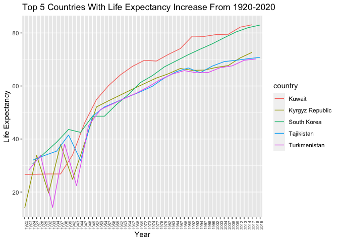
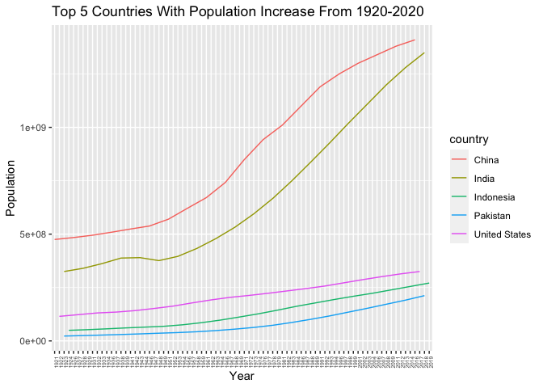
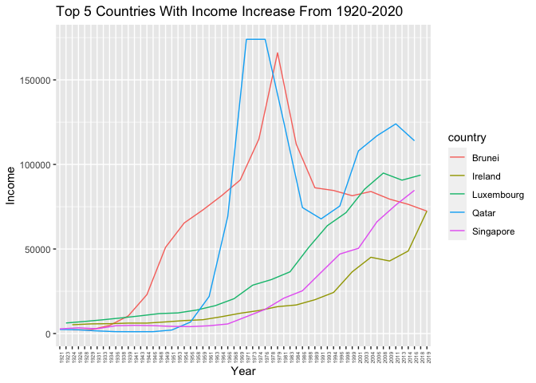
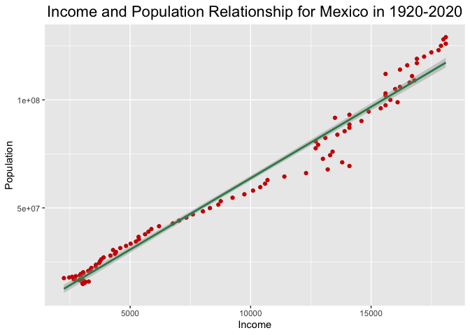

## Instructions
Answer the following questions and complete the exercises in RMarkdown. Please embed all of your code and push your final work to your repository. Your code should be organized, clean, and run free from errors. Be sure to **add your name** to the author header above. You may use any resources to answer these questions (including each other), but you may not post questions to Open Stacks or external help sites. There are 10 total questions.  

Make sure to use the formatting conventions of RMarkdown to make your report neat and clean! Your plots should use consistent aesthetics throughout.  

This exam is due by **12:00p on Tuesday, February 22**.  

## Gapminder
For this assignment, we are going to use data from  [gapminder](https://www.gapminder.org/). Gapminder includes information about economics, population, social issues, and life expectancy from countries all over the world. We will use three data sets, so please load all three as separate objects.    

1. population_total.csv  
2. income_per_person_gdppercapita_ppp_inflation_adjusted.csv  
3. life_expectancy_years.csv  


```r
library(tidyverse)
library(here)
library(janitor)
```


```r
population <- readr::read_csv("data/population_total.csv")
```

```
## Rows: 195 Columns: 302
## ── Column specification ────────────────────────────────────────────────────────
## Delimiter: ","
## chr   (1): country
## dbl (301): 1800, 1801, 1802, 1803, 1804, 1805, 1806, 1807, 1808, 1809, 1810,...
## 
## ℹ Use `spec()` to retrieve the full column specification for this data.
## ℹ Specify the column types or set `show_col_types = FALSE` to quiet this message.
```


```r
income <- readr::read_csv("data/income_per_person_gdppercapita_ppp_inflation_adjusted.csv")
```

```
## Rows: 193 Columns: 242
## ── Column specification ────────────────────────────────────────────────────────
## Delimiter: ","
## chr   (1): country
## dbl (241): 1800, 1801, 1802, 1803, 1804, 1805, 1806, 1807, 1808, 1809, 1810,...
## 
## ℹ Use `spec()` to retrieve the full column specification for this data.
## ℹ Specify the column types or set `show_col_types = FALSE` to quiet this message.
```


```r
life_exp <- readr::read_csv("data/life_expectancy_years.csv")
```

```
## Rows: 187 Columns: 302
## ── Column specification ────────────────────────────────────────────────────────
## Delimiter: ","
## chr   (1): country
## dbl (301): 1800, 1801, 1802, 1803, 1804, 1805, 1806, 1807, 1808, 1809, 1810,...
## 
## ℹ Use `spec()` to retrieve the full column specification for this data.
## ℹ Specify the column types or set `show_col_types = FALSE` to quiet this message.
```

1. (3 points) Once you have an idea of the structure of the data, please make each data set tidy (hint: think back to pivots) and store them as new objects. You will need both the original (wide) and tidy (long) data!  

**Population**

```r
population
```

```
## # A tibble: 195 × 302
##    country `1800` `1801` `1802` `1803` `1804` `1805` `1806` `1807` `1808` `1809`
##    <chr>    <dbl>  <dbl>  <dbl>  <dbl>  <dbl>  <dbl>  <dbl>  <dbl>  <dbl>  <dbl>
##  1 Afghan… 3.28e6 3.28e6 3.28e6 3.28e6 3.28e6 3.28e6 3.28e6 3.28e6 3.28e6 3.28e6
##  2 Albania 4   e5 4.02e5 4.04e5 4.05e5 4.07e5 4.09e5 4.11e5 4.13e5 4.14e5 4.16e5
##  3 Algeria 2.5 e6 2.51e6 2.52e6 2.53e6 2.54e6 2.55e6 2.56e6 2.56e6 2.57e6 2.58e6
##  4 Andorra 2.65e3 2.65e3 2.65e3 2.65e3 2.65e3 2.65e3 2.65e3 2.65e3 2.65e3 2.65e3
##  5 Angola  1.57e6 1.57e6 1.57e6 1.57e6 1.57e6 1.57e6 1.57e6 1.57e6 1.57e6 1.57e6
##  6 Antigu… 3.7 e4 3.7 e4 3.7 e4 3.7 e4 3.7 e4 3.7 e4 3.7 e4 3.7 e4 3.7 e4 3.7 e4
##  7 Argent… 5.34e5 5.2 e5 5.06e5 4.92e5 4.79e5 4.66e5 4.53e5 4.41e5 4.29e5 4.17e5
##  8 Armenia 4.13e5 4.13e5 4.13e5 4.13e5 4.13e5 4.13e5 4.13e5 4.13e5 4.13e5 4.13e5
##  9 Austra… 2   e5 2.05e5 2.11e5 2.16e5 2.22e5 2.27e5 2.33e5 2.39e5 2.46e5 2.52e5
## 10 Austria 3   e6 3.02e6 3.04e6 3.05e6 3.07e6 3.09e6 3.11e6 3.12e6 3.14e6 3.16e6
## # … with 185 more rows, and 291 more variables: `1810` <dbl>, `1811` <dbl>,
## #   `1812` <dbl>, `1813` <dbl>, `1814` <dbl>, `1815` <dbl>, `1816` <dbl>,
## #   `1817` <dbl>, `1818` <dbl>, `1819` <dbl>, `1820` <dbl>, `1821` <dbl>,
## #   `1822` <dbl>, `1823` <dbl>, `1824` <dbl>, `1825` <dbl>, `1826` <dbl>,
## #   `1827` <dbl>, `1828` <dbl>, `1829` <dbl>, `1830` <dbl>, `1831` <dbl>,
## #   `1832` <dbl>, `1833` <dbl>, `1834` <dbl>, `1835` <dbl>, `1836` <dbl>,
## #   `1837` <dbl>, `1838` <dbl>, `1839` <dbl>, `1840` <dbl>, `1841` <dbl>, …
```


```r
long_population<-population%>%
pivot_longer(-country, 
               names_to = "year", 
               values_to = "population")
long_population
```

```
## # A tibble: 58,695 × 3
##    country     year  population
##    <chr>       <chr>      <dbl>
##  1 Afghanistan 1800     3280000
##  2 Afghanistan 1801     3280000
##  3 Afghanistan 1802     3280000
##  4 Afghanistan 1803     3280000
##  5 Afghanistan 1804     3280000
##  6 Afghanistan 1805     3280000
##  7 Afghanistan 1806     3280000
##  8 Afghanistan 1807     3280000
##  9 Afghanistan 1808     3280000
## 10 Afghanistan 1809     3280000
## # … with 58,685 more rows
```

**Income**

```r
income
```

```
## # A tibble: 193 × 242
##    country `1800` `1801` `1802` `1803` `1804` `1805` `1806` `1807` `1808` `1809`
##    <chr>    <dbl>  <dbl>  <dbl>  <dbl>  <dbl>  <dbl>  <dbl>  <dbl>  <dbl>  <dbl>
##  1 Afghan…    603    603    603    603    603    603    603    603    603    603
##  2 Albania    667    667    667    667    667    668    668    668    668    668
##  3 Algeria    715    716    717    718    719    720    721    722    723    724
##  4 Andorra   1200   1200   1200   1200   1210   1210   1210   1210   1220   1220
##  5 Angola     618    620    623    626    628    631    634    637    640    642
##  6 Antigu…    757    757    757    757    757    757    757    758    758    758
##  7 Argent…   1640   1640   1650   1650   1660   1660   1670   1680   1680   1690
##  8 Armenia    514    514    514    514    514    514    514    514    514    514
##  9 Austra…    817    822    826    831    836    841    845    850    855    860
## 10 Austria   1850   1850   1860   1870   1880   1880   1890   1900   1910   1920
## # … with 183 more rows, and 231 more variables: `1810` <dbl>, `1811` <dbl>,
## #   `1812` <dbl>, `1813` <dbl>, `1814` <dbl>, `1815` <dbl>, `1816` <dbl>,
## #   `1817` <dbl>, `1818` <dbl>, `1819` <dbl>, `1820` <dbl>, `1821` <dbl>,
## #   `1822` <dbl>, `1823` <dbl>, `1824` <dbl>, `1825` <dbl>, `1826` <dbl>,
## #   `1827` <dbl>, `1828` <dbl>, `1829` <dbl>, `1830` <dbl>, `1831` <dbl>,
## #   `1832` <dbl>, `1833` <dbl>, `1834` <dbl>, `1835` <dbl>, `1836` <dbl>,
## #   `1837` <dbl>, `1838` <dbl>, `1839` <dbl>, `1840` <dbl>, `1841` <dbl>, …
```


```r
long_income<-income%>% 
  pivot_longer(-country, 
               names_to = "year", 
               values_to = "income")
long_income
```

```
## # A tibble: 46,513 × 3
##    country     year  income
##    <chr>       <chr>  <dbl>
##  1 Afghanistan 1800     603
##  2 Afghanistan 1801     603
##  3 Afghanistan 1802     603
##  4 Afghanistan 1803     603
##  5 Afghanistan 1804     603
##  6 Afghanistan 1805     603
##  7 Afghanistan 1806     603
##  8 Afghanistan 1807     603
##  9 Afghanistan 1808     603
## 10 Afghanistan 1809     603
## # … with 46,503 more rows
```

**Life Expectancy**

```r
life_exp
```

```
## # A tibble: 187 × 302
##    country `1800` `1801` `1802` `1803` `1804` `1805` `1806` `1807` `1808` `1809`
##    <chr>    <dbl>  <dbl>  <dbl>  <dbl>  <dbl>  <dbl>  <dbl>  <dbl>  <dbl>  <dbl>
##  1 Afghan…   28.2   28.2   28.2   28.2   28.2   28.2   28.1   28.1   28.1   28.1
##  2 Albania   35.4   35.4   35.4   35.4   35.4   35.4   35.4   35.4   35.4   35.4
##  3 Algeria   28.8   28.8   28.8   28.8   28.8   28.8   28.8   28.8   28.8   28.8
##  4 Andorra   NA     NA     NA     NA     NA     NA     NA     NA     NA     NA  
##  5 Angola    27     27     27     27     27     27     27     27     27     27  
##  6 Antigu…   33.5   33.5   33.5   33.5   33.5   33.5   33.5   33.5   33.5   33.5
##  7 Argent…   33.2   33.2   33.2   33.2   33.2   33.2   33.2   33.2   33.2   33.2
##  8 Armenia   34     34     34     34     34     34     34     34     34     34  
##  9 Austra…   34     34     34     34     34     34     34     34     34     34  
## 10 Austria   34.4   34.4   34.4   34.4   34.4   34.4   34.4   34.4   34.4   34.4
## # … with 177 more rows, and 291 more variables: `1810` <dbl>, `1811` <dbl>,
## #   `1812` <dbl>, `1813` <dbl>, `1814` <dbl>, `1815` <dbl>, `1816` <dbl>,
## #   `1817` <dbl>, `1818` <dbl>, `1819` <dbl>, `1820` <dbl>, `1821` <dbl>,
## #   `1822` <dbl>, `1823` <dbl>, `1824` <dbl>, `1825` <dbl>, `1826` <dbl>,
## #   `1827` <dbl>, `1828` <dbl>, `1829` <dbl>, `1830` <dbl>, `1831` <dbl>,
## #   `1832` <dbl>, `1833` <dbl>, `1834` <dbl>, `1835` <dbl>, `1836` <dbl>,
## #   `1837` <dbl>, `1838` <dbl>, `1839` <dbl>, `1840` <dbl>, `1841` <dbl>, …
```


```r
long_life_exp<-life_exp%>%
  pivot_longer(-country, 
               names_to = "year", 
               values_to = "life_exp",
               values_drop_na = T)
long_life_exp
```

```
## # A tibble: 55,528 × 3
##    country     year  life_exp
##    <chr>       <chr>    <dbl>
##  1 Afghanistan 1800      28.2
##  2 Afghanistan 1801      28.2
##  3 Afghanistan 1802      28.2
##  4 Afghanistan 1803      28.2
##  5 Afghanistan 1804      28.2
##  6 Afghanistan 1805      28.2
##  7 Afghanistan 1806      28.1
##  8 Afghanistan 1807      28.1
##  9 Afghanistan 1808      28.1
## 10 Afghanistan 1809      28.1
## # … with 55,518 more rows
```

2. (1 point) How many different countries are represented in the data? Provide the total number and their names. Since each data set includes different numbers of countries, you will need to do this for each one.  

**Population Count Per Country**

```r
long_population%>%
  count(country)
```

```
## # A tibble: 195 × 2
##    country                 n
##    <chr>               <int>
##  1 Afghanistan           301
##  2 Albania               301
##  3 Algeria               301
##  4 Andorra               301
##  5 Angola                301
##  6 Antigua and Barbuda   301
##  7 Argentina             301
##  8 Armenia               301
##  9 Australia             301
## 10 Austria               301
## # … with 185 more rows
```

**Income Per Country**

```r
long_income%>%
  count(country)
```

```
## # A tibble: 193 × 2
##    country                 n
##    <chr>               <int>
##  1 Afghanistan           241
##  2 Albania               241
##  3 Algeria               241
##  4 Andorra               241
##  5 Angola                241
##  6 Antigua and Barbuda   241
##  7 Argentina             241
##  8 Armenia               241
##  9 Australia             241
## 10 Austria               241
## # … with 183 more rows
```

**Life Expectancy Per Country**

```r
long_life_exp%>%
  count(country)
```

```
## # A tibble: 187 × 2
##    country                 n
##    <chr>               <int>
##  1 Afghanistan           301
##  2 Albania               301
##  3 Algeria               301
##  4 Andorra                48
##  5 Angola                301
##  6 Antigua and Barbuda   301
##  7 Argentina             301
##  8 Armenia               301
##  9 Australia             301
## 10 Austria               301
## # … with 177 more rows
```

## Life Expectancy  

3. (2 points) Let's limit the data to 100 years (1920-2020). For these years, which country has the highest average life expectancy? How about the lowest average life expectancy?  


```r
life_exp_year<-long_life_exp%>%
filter(between(year, 1920, 2020))
life_exp_year
```

```
## # A tibble: 18,728 × 3
##    country     year  life_exp
##    <chr>       <chr>    <dbl>
##  1 Afghanistan 1920      30.6
##  2 Afghanistan 1921      30.7
##  3 Afghanistan 1922      30.8
##  4 Afghanistan 1923      30.8
##  5 Afghanistan 1924      30.9
##  6 Afghanistan 1925      31  
##  7 Afghanistan 1926      31  
##  8 Afghanistan 1927      31.1
##  9 Afghanistan 1928      31.1
## 10 Afghanistan 1929      31.2
## # … with 18,718 more rows
```


```r
life_exp_means<-life_exp_year%>%
  group_by(country)%>%
  summarize(mean_life_exp=mean(life_exp))%>%
  arrange(desc(mean_life_exp))
life_exp_means
```

```
## # A tibble: 187 × 2
##    country     mean_life_exp
##    <chr>               <dbl>
##  1 Andorra              79.8
##  2 Sweden               73.5
##  3 Norway               73.2
##  4 Netherlands          73.0
##  5 Dominica             73.0
##  6 Iceland              72.9
##  7 Australia            72.7
##  8 Switzerland          72.7
##  9 Denmark              71.9
## 10 Canada               71.8
## # … with 177 more rows
```
#The highest life expectancy between the years of 1920 to 2020 goes to Andorra at 79.77083 years old. On the contrary, the lowest life expectancy between the years of 1920 to 2020 goes to Central African Republic at 41.76634	years old.

4. (3 points) Although we can see which country has the highest life expectancy for the past 100 years, we don't know which countries have changed the most. What are the top 5 countries that have experienced the biggest improvement in life expectancy between 1920-2020?  


```r
life_exp_growth<-life_exp_year%>%
  select(country,year,life_exp)%>%
  filter(year=="1920"|year=="2020")%>%
  pivot_wider(names_from = year, names_prefix = "year_", values_from = life_exp)%>%
  mutate(growth=year_2020-year_1920)%>%
  arrange(desc(growth))
life_exp_growth
```

```
## # A tibble: 184 × 4
##    country         year_1920 year_2020 growth
##    <chr>               <dbl>     <dbl>  <dbl>
##  1 Kuwait               26.6      83.4   56.8
##  2 Kyrgyz Republic      16.6      73.1   56.5
##  3 Turkmenistan         15.2      70.5   55.3
##  4 South Korea          28.2      83.2   55  
##  5 Tajikistan           16.7      71     54.3
##  6 Nicaragua            25.3      79.5   54.2
##  7 Kazakhstan           19.3      73.1   53.8
##  8 Russia               20.5      72.7   52.2
##  9 Israel               32        83.4   51.4
## 10 Iran                 26.8      78     51.2
## # … with 174 more rows
```

5. (3 points) Make a plot that shows the change over the past 100 years for the country with the biggest improvement in life expectancy. Be sure to add appropriate aesthetics to make the plot clean and clear. Once you have made the plot, do a little internet searching and see if you can discover what historical event may have contributed to this remarkable change.  


```r
life_exp_year%>%
   filter(country==c("Kuwait", "Kyrgyz Republic", "Turkmenistan", "South Korea", "Tajikistan"))%>%
  select(country,year, life_exp)%>%
  ggplot(aes(x=year, y=life_exp, group=country, color=country))+
  geom_line()+
  theme(axis.text.x = element_text(angle =90, hjust = 1, size = 6))+
  labs(title = "Top 5 Countries With Life Expectancy Increase From 1920-2020",
       x = "Year",
       y = "Life Expectancy")
```

```
## Warning in country == c("Kuwait", "Kyrgyz Republic", "Turkmenistan", "South
## Korea", : longer object length is not a multiple of shorter object length
```

<!-- -->
#Life expectancy has increased for these countries mainly becasue the economy was rising, and vaccines/medication practices were introduced. Infant deaths declined, and so did diseases that killed off the population.

## Population Growth
6. (3 points) Which 5 countries have had the highest population growth over the past 100 years (1920-2020)?  


```r
pop_year<-long_population%>%
filter(between(year, 1920, 2020))
pop_year
```

```
## # A tibble: 19,695 × 3
##    country     year  population
##    <chr>       <chr>      <dbl>
##  1 Afghanistan 1920    10600000
##  2 Afghanistan 1921    10500000
##  3 Afghanistan 1922    10300000
##  4 Afghanistan 1923     9710000
##  5 Afghanistan 1924     9200000
##  6 Afghanistan 1925     8720000
##  7 Afghanistan 1926     8260000
##  8 Afghanistan 1927     7830000
##  9 Afghanistan 1928     7420000
## 10 Afghanistan 1929     7100000
## # … with 19,685 more rows
```


```r
pop_growth<-pop_year%>%
  select(country,year,population)%>%
  filter(year=="1920"|year=="2020")%>%
  pivot_wider(names_from = year, names_prefix = "year_", values_from = population)%>%
  mutate(growth=year_2020-year_1920)%>%
  arrange(desc(growth))
pop_growth
```

```
## # A tibble: 195 × 4
##    country       year_1920  year_2020     growth
##    <chr>             <dbl>      <dbl>      <dbl>
##  1 India         317000000 1380000000 1063000000
##  2 China         472000000 1440000000  968000000
##  3 Indonesia      47300000  274000000  226700000
##  4 United States 111000000  331000000  220000000
##  5 Pakistan       21700000  221000000  199300000
##  6 Brazil         27600000  213000000  185400000
##  7 Nigeria        23300000  206000000  182700000
##  8 Bangladesh     27300000  165000000  137700000
##  9 Mexico         14800000  129000000  114200000
## 10 Philippines     9400000  110000000  100600000
## # … with 185 more rows
```

7. (4 points) Produce a plot that shows the 5 countries that have had the highest population growth over the past 100 years (1920-2020). Which countries appear to have had exponential growth?  


```r
pop_year%>%
   filter(country==c("India", "China", "Indonesia", "United States", "Pakistan"))%>%
  select(country,year,population)%>%
  ggplot(aes(x=year, y=population, group=country, color=country))+
  geom_line()+
  theme(axis.text.x = element_text(angle =90, hjust = 1, size = 5))+
  labs(title = "Top 5 Countries With Population Increase From 1920-2020",
       x = "Year",
       y = "Population")
```

<!-- -->
#There is an exponrntial growth for both China and India. Indonesia, Pakistan, and the United States also increased, it looks a bit like a logistic growth, but I could be wrong.

## Income
The units used for income are gross domestic product per person adjusted for differences in purchasing power in international dollars.

8. (4 points) As in the previous questions, which countries have experienced the biggest growth in per person GDP. Show this as a table and then plot the changes for the top 5 countries. With a bit of research, you should be able to explain the dramatic downturns of the wealthiest economies that occurred during the 1980's.  


```r
income_year<-long_income%>%
filter(between(year, 1920, 2020))
income_year
```

```
## # A tibble: 19,493 × 3
##    country     year  income
##    <chr>       <chr>  <dbl>
##  1 Afghanistan 1920    1490
##  2 Afghanistan 1921    1520
##  3 Afghanistan 1922    1550
##  4 Afghanistan 1923    1570
##  5 Afghanistan 1924    1600
##  6 Afghanistan 1925    1630
##  7 Afghanistan 1926    1650
##  8 Afghanistan 1927    1680
##  9 Afghanistan 1928    1710
## 10 Afghanistan 1929    1740
## # … with 19,483 more rows
```


```r
income_growth<-income_year%>%
  select(country,year,income)%>%
  filter(year=="1920"|year=="2020")%>%
  pivot_wider(names_from = year, names_prefix = "year_", values_from = income)%>%
  mutate(growth=year_2020-year_1920)%>%
  arrange(desc(growth))
income_growth
```

```
## # A tibble: 193 × 4
##    country              year_1920 year_2020 growth
##    <chr>                    <dbl>     <dbl>  <dbl>
##  1 Qatar                     2300    116000 113700
##  2 Luxembourg                5730     95100  89370
##  3 Singapore                 2440     90500  88060
##  4 Brunei                    2130     75100  72970
##  5 Ireland                   5170     74100  68930
##  6 United Arab Emirates      2090     65300  63210
##  7 Kuwait                    2350     64300  61950
##  8 Norway                    8960     67500  58540
##  9 Monaco                    6630     62000  55370
## 10 San Marino                3280     57900  54620
## # … with 183 more rows
```


```r
income_year%>%
   filter(country==c("Qatar", "Luxembourg", "Singapore", "Brunei", "Ireland"))%>%
  select(country,year, income)%>%
  ggplot(aes(x=year, y=income, group=country, color=country))+
  geom_line()+
  theme(axis.text.x = element_text(angle =90, hjust = 1, size = 5))+
  labs(title = "Top 5 Countries With Income Increase From 1920-2020",
       x = "Year",
       y = "Income")
```

```
## Warning in country == c("Qatar", "Luxembourg", "Singapore", "Brunei",
## "Ireland"): longer object length is not a multiple of shorter object length
```

<!-- -->
#Brunei's economy dropped on the 1980's becasue their main source of wealth was their oil. They had to stop oil production because they were overdoing it and wanted to preserve some, so that's why it dropped. Almost the same event happend to Qatar.

9. (3 points) Create three new objects that restrict each data set (life expectancy, population, income) to the years 1920-2020. Hint: I suggest doing this with the long form of your data. Once this is done, merge all three data sets using the code I provide below. You may need to adjust the code depending on how you have named your objects. I called mine `life_expectancy_100`, `population_100`, and `income_100`. For some of you, learning these `joins` will be important for your project.  


```r
gapminder_join <- inner_join(life_exp_year, pop_year, by= c("country", "year"))
gapminder_join <- inner_join(gapminder_join, income_year, by= c("country", "year"))
gapminder_join
```

```
## # A tibble: 18,728 × 5
##    country     year  life_exp population income
##    <chr>       <chr>    <dbl>      <dbl>  <dbl>
##  1 Afghanistan 1920      30.6   10600000   1490
##  2 Afghanistan 1921      30.7   10500000   1520
##  3 Afghanistan 1922      30.8   10300000   1550
##  4 Afghanistan 1923      30.8    9710000   1570
##  5 Afghanistan 1924      30.9    9200000   1600
##  6 Afghanistan 1925      31      8720000   1630
##  7 Afghanistan 1926      31      8260000   1650
##  8 Afghanistan 1927      31.1    7830000   1680
##  9 Afghanistan 1928      31.1    7420000   1710
## 10 Afghanistan 1929      31.2    7100000   1740
## # … with 18,718 more rows
```

10. (4 points) Use the joined data to perform an analysis of your choice. The analysis should include a comparison between two or more of the variables `life_expectancy`, `population`, or `income.`  


```r
gapminder_join%>%
select(country, year, life_exp, population, income)%>%
filter(country=="Mexico")
```

```
## # A tibble: 101 × 5
##    country year  life_exp population income
##    <chr>   <chr>    <dbl>      <dbl>  <dbl>
##  1 Mexico  1920      31.9   14800000   3040
##  2 Mexico  1921      32.3   14900000   3030
##  3 Mexico  1922      32.8   15100000   3050
##  4 Mexico  1923      33.7   15300000   3110
##  5 Mexico  1924      33     15500000   3010
##  6 Mexico  1925      32.3   15700000   3140
##  7 Mexico  1926      34.4   15900000   3280
##  8 Mexico  1927      40.5   16200000   3080
##  9 Mexico  1928      34.7   16400000   3050
## 10 Mexico  1929      35.6   16600000   2890
## # … with 91 more rows
```


```r
#install.packages("ggthemes")
library(ggthemes)
```


```r
gapminder_join%>%
select(country, year, life_exp, population, income)%>%
filter(country=="Mexico")%>%
  ggplot(mapping=aes(x=income, y=population)) +
  geom_point(color="red3")+
  geom_smooth(method=lm,color="seagreen", se=T)+
labs(title = "Income and Population Relationship for Mexico in 1920-2020",
       x = "Income",
       y = "Population")+
  theme(plot.title = element_text(size = rel(1.5), hjust = 0.5))
```

```
## `geom_smooth()` using formula 'y ~ x'
```

<!-- -->


